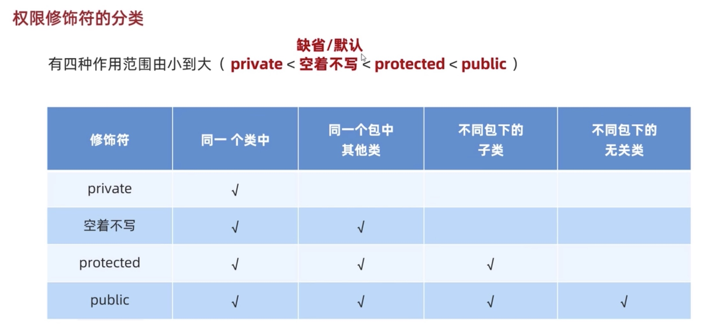

[返回目录](./1.%20java学习目录.md)
# 面向对象细节部分
[pakage 包](#table2)
[final](./Fianl关键字.md)
[权限修饰符](#table3)
[code block 代码块](#table4)

## 多态

[instanceof 对比变量属性](#table1)

### 什么是多态？
在继承关系下, 使用父类的类型 修饰子类的定义。称为多态。
`Person stu = new Student();` //Person是父类, Student是子类, 用父类修饰子类定义。
这种方式主要用在参数传递中, 我们可以定义多个不同的子类object, 然后这些不同的子类object通过父类定义的参数传递到方法中。

### 多态情况下的数据读取
1. 多态的创建方式： Parent name = new Child();
2. 在调用成员变量时, 编译看左边, 运行也看左边。
   ```java
        public static void main(String[] args) {
        Animal a = new Dog();
        System.out.println(a.name);
    }
   ```
   上面这段代码, Animal class是Parent, Dog class是Child。在获取`a.name`时, print出来的是 Animal。  
   所以, 调用成员变量时, 先看Parent(左边)有没有这个变量. 如果有, 编译成功. 没有, 则看编译失败（会报错）。
3. 在调用成员方法时：编译看左边, 运行看右边
   ```java
        public static void main(String[] args) {
        Animal a = new Dog();
        System.out.println(a.name);// print: Aniaml
        a.show(); // print: "Dog --- show method"
        }

        class Animal{
            String name = "Animal"; // 如果parent里没有这行变量, 则main class内的a.name会报错
            // 如果Parent内的方法不存在, 程序同样报错
            public void show(){
                System.out.println("Animal --- show method");
            }
        }

        class Dog extends Animal{
            String name = "Dog";
            @Override
            public void show(){
                // main class调用show方法时, 运行的是Child的方法。
                System.out.println("Dog --- show method");
            }
        }
   ```
4. **可以理解为, 子类的变量不能覆盖父类的变量, 但重载的方法可以覆盖父类的方法。**

### <a id="table1">instanceof 对比变量定义的属性</a>
在**多态**情况下, 对象只能调用重载的方法, 也就是parent class内存在的方法。   
如果要使用Parent内不存在的方法, 我们可以把对象重新变更属性后赋值给另一个。
我们可以通过如下代码判断变量是否在可变更属性的范围内并强制更改变量的归属。
```java
if(a instanceof Dog){ //确认child class是dog
    Dog c = (Dog) a; //把 a 的属性从parent 变更回 child
}

// JDK14, 新特性写法
if(a instanceof Dog d){
    // 以上代码先判断 a 是否符合dog类型, 符合则直接转换并赋值给D, 
    // 这里可以直接写上赋值后需要调用的方法。
}
```


### <a id="table2">package</a>
package 包就是文件夹, 用来管理各种不同功能的java class, 方案代码维护
* 包名的规则： 公司域名反写+加包的作用, 全部小写, 见名知意。
* 导包的规则：
    1. 使用同一个package中的class时, 不需要import package
    2. 使用java.lang包中的class时, 不需要import
    3. 其他情况都需要 import package
    4. 如果import 的两个package中有同名的class, 即便导包也需要使用全类名定义:
`com.itmehit.domain.Student s = new com.itmehit.domain.Student();`
    

### <a id="table3">权限修饰符</a>

权限修饰符分类：

private: 只能自己用
空/默认: 可以在本包内使用
protected: 相关类能用
public: 全都能用
==实际开发过程中, 一般只用` private `和 `public`==, 使用规则如下：
1. object的成员变量(属性): private
2. method function: public
   特例：如果方法中的代码是抽取其他方法中共性代码, 这个方法一般也是private。


### <a id="table4">code block 代码块</a>
1. 局部代码块
   在代码块内的块。
2. 构造代码块
   
3. 静态代码块
需要通过static 关键字修饰, 随着class加载而加载, 并且自动触发、只执行一次。
```java
    static{
        //Class内的静态代码块随Class一起出发, 且只触发一次。
    }
```
==可以作为只运行一次的数据初始化用途。==