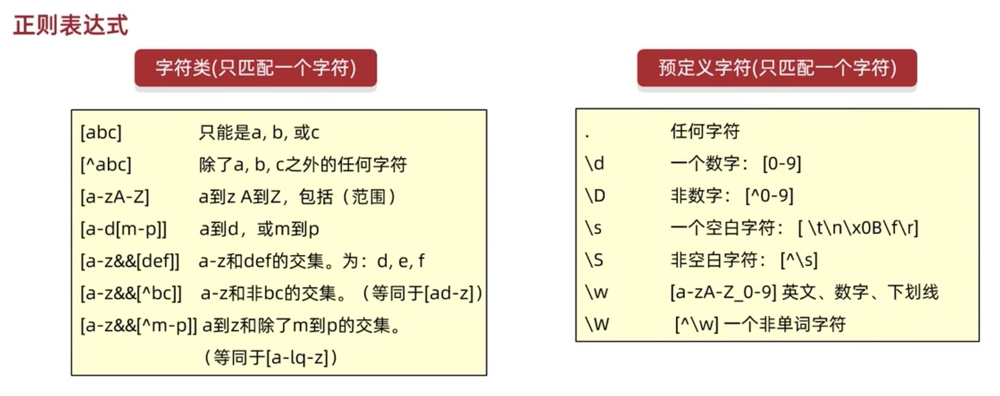
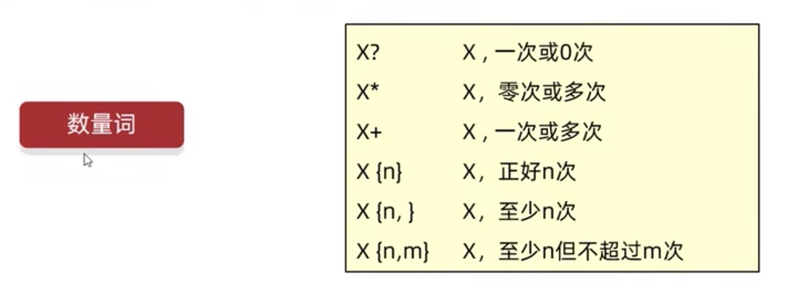

[返回目录](./1.%20java学习目录.md)

# 常用API

[Arrays API](#table1)

## Runtime API
```java
 public static Runtime getRuntime() // 当前系统的运行环境对象
 public void exit(int status)       // 停止虚拟机
 public int availableProcessors()   // 获得CPU的线程数
 public long maxMemory()            // JVM能从系统中获取总内存大小（单位byte）
 public long totalMemory()          //JVM已经从系统中获取总内存大小
 public long freeMemory()           //JVM剩余内存大小
 public Process exec(String command)//运行cmd命令

//调用方法
Runtime.getRuntime().totalMemory(); 
```

## 获取当前时间
```java
public static long currentTimeMillis() // 返回当前系统的时间毫秒值形式
public static void arraycopy(数据源数组，起始索引，目的地数组，起始索引，copy数量)
```

## 正则表达式
作用1: 校验字符串是否符合规则
作用2: 在一段文本中查找满足要求的内容

```java
(object or variable).matches(正则表达式的规则)
"a".matches("[abc]"); // 是否属于abc其中之一，true
"ab".matches("[abc][abc]") //每个条件只判断一个字符，所以如果一个string里有两个字符，需要两个正则判断条件。
"0".matches("[a-bA-Z0-9]") //条件不需要用逗号分隔
"a".matches("[a-b[m-z]]") //条件内的条件代表 or
"a".matches("[a-b && [bef]]") // && 表示两个条件的交集，也就是同时满足两个正则条件。
"3".matches("\\d") // 表示数字。第一个"\"是转义字符，后面是正则规则
```

```java
"333333".matches("\\w{6,}") //符合w的规则至少出现6次
```

```java
        // Pattern:表示正则表达式对象
        // Matcher:文本匹配器，作用按照正则表达式的规则去读取字符串，从头开始读取。
        //          在大串中，寻找符合匹配规则的字串。
        Pattern p = Pattern.compile("Java\\d{2}");
        // m要在str中找符合p规则的小串
        Matcher m = p.matcher(str);
        // 确定是否右满足条件的子串
        boolean b = m.find();
        String s1 = m.group();
```


### <a id="table1">Arrays API</a>
```java
public static String toString(Array) // 把数组拼成一个字符串
public static int binarySearch(Array, element) // 二分查找发查找数组内指定元素
public static int[] copyOf(原数组，新数组长度) //copy 数组
public static int[] copyOfRange(原数组，起始索引，结束索引) //copy 数组（指定范围）
public static void fill(数组，元素)  //填充数组
public static void sort(数组)   //按默认方式排序
public static void sort(数组，排序规则)  //按规则排序

// 执行代码
int[] arr = {1,2,3,4,5,6,7,8,9}
Arrays.toString(arr); // [1, 2, 3, 4, 5, 6, 7, 8, 9]
// 返回element index，如果不存在，则返回插入点-1.
Arrays.binarySearch(arr, 6); // return 5

```

### Lambda表达式
1. 简化函数接口的匿名内部类写法。
2. 必须是接口的匿名内部类，接口中只能有一个抽象方法。

```java
/*        method(new Swim() {
            @Override
            public void swim() {
                System.out.println("swimming");
            }
        });*/
        // 结构为"()->{}", 花括号内重写方法。
        method(()->{
            System.out.println("swimming");
        });
    

    public static void method(Swim s) {
        s.swim();
    }

    interface Swim {
        public abstract void swim();
    }
```
