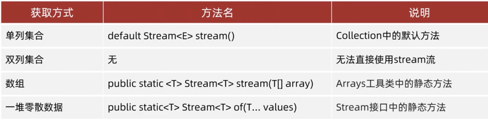
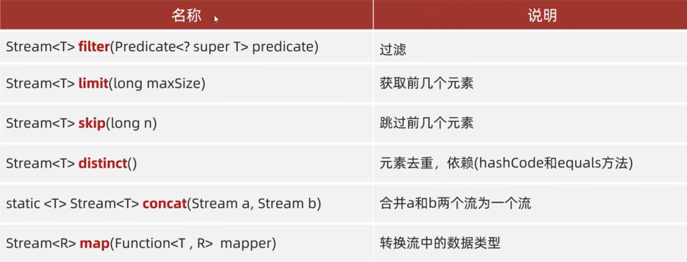
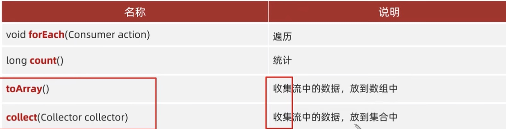

[返回目录](./1.%20java学习目录.md)

# Stream 流

 ### 1. 什么是stream流？
Stream流，就是把许多方法串联在一起，在一条代码下顺序运行下去的方法流。

 ```java
        ArrayList<String> s = new ArrayList<>();
        Collections.addAll(s,"zhang san", "li si", "wang wu", "zhang liu", "zhang wu ji", "zhao ming", "zhang san feng");

        // 1.把所有“zhang”开头的元素，储存到新的集合中
        ArrayList<String> s2 = new ArrayList<>();
        for (String name : s) {
            if(name.startsWith("zhang")){
                s2.add(name);
            }
        }

        // 2. 再把长度大于9的储存到一个新的集合中
        ArrayList<String> s3 = new ArrayList<>();
        for (String string : s2) {
            if(string.length() > 9){
                s3.add(string);
            }
        }
        System.out.println(s3);
 ```
上面的代码很繁琐，而且是一个一步一步进行的顺序代码。
我们可以通过stream流来简化它
 ```java
 //格式：ListName.stream()
 //然后跟filter方法：ListName.stream().filter(name->name.startsWith("zhang"))
 //filter方法中的name是参数赋值，等于在原始List内创建一个子数组。然后加上子数组的规则方法。filter可以多次调用，每次调用都是对前一次结果的再筛选。最后使用forEach遍历。
s.stream().filter(name->name.startsWith("zhang")).filter(name->name.length() > 9).forEach(name-> System.out.println(name));
 ```


 ### Stream流使用步骤
 1. 得到一条stream流，并将数据放上去

    但Map也不是绝对不能使用stream流，我们可以取巧
```java
        HashMap<String, Integer> s1 = new HashMap<>();
        s1.put("kevin", 30);
        s1.put("angela", 30);
        s1.put("cathy",40);
        s1.put("wendy", 20);

        // 仅遍历并显示key
        s1.keySet().stream().forEach(ss -> System.out.println(ss));
        // 显示key->value pair
        s1.entrySet().stream().forEach(ss-> System.out.println(ss));
```
 2. 使用 ***中间方法*** 对流水线上的数据进行操作
   

对Stream流的数据操作，是不会改变原数据的。
具体的实例代码就不打了，以后要用的时候再熟悉查也行。

 3. 使用 ***终结方法*** 对流水线上的数据进行操作
   

```java
        //遍历之前有展示
        //count比较简单
        long count = s.stream().count();//延用第一个arraylist

        //toArray：将list变换为一个Array
        // 空参的转换
        Object[] array = s.stream().toArray();
        System.out.println(Arrays.toString(array));

        //有参需要重写class内的方法，暂时不看
       
```
