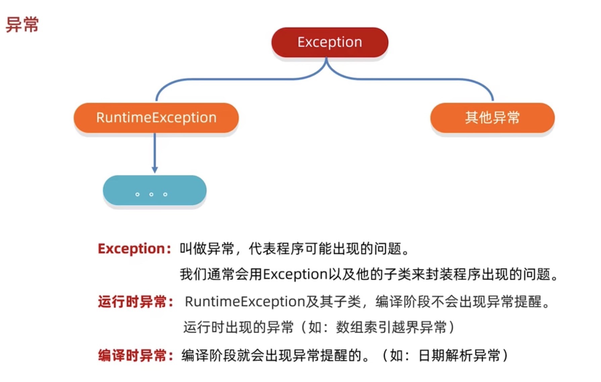

# method recall 方法引用

### 方法引用
把已经有的方法直接拿过来用，当作函数式接口中抽象方法的方法体。
具体内容以后查

### 异常
编码时，java.lang.Throwable会抛出两个主类异常：
1. Error：代表系统级别错误（属于严重问题）跟开发程序员无关。
2. Exception： 叫做异常，代表程序可能出现的问题。
   1. RuntimeException及其子类
   2. Other

