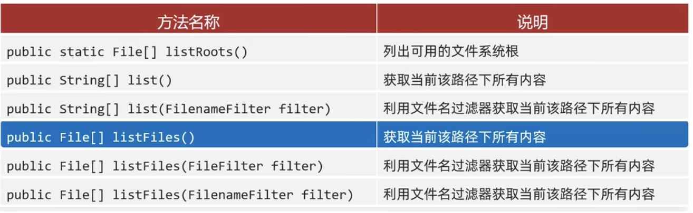
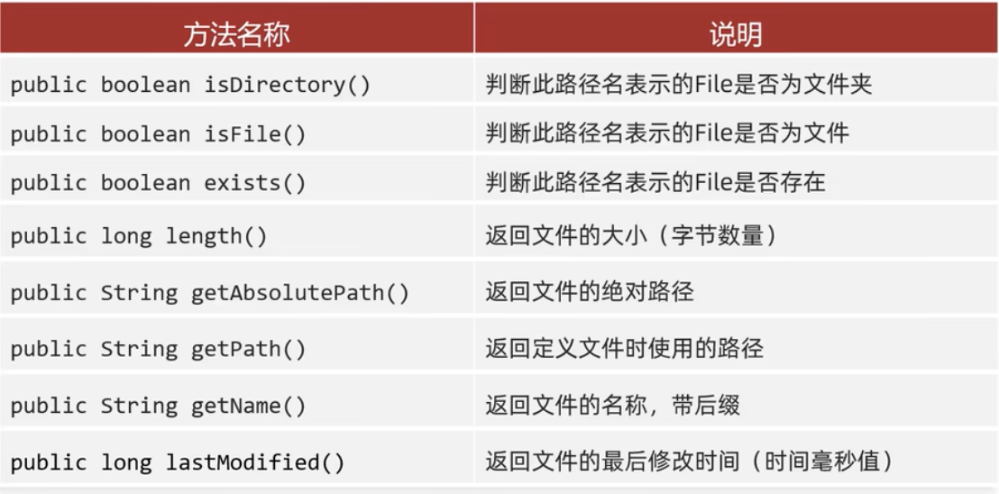

[返回首页](./1.%20java学习目录.md)

# File 文件

### 概述
*   相对路径： "a.txt", "abc.txt", 等不带盘符和具体路径的文件路径，这类一般适用于与运行代码在同一文件夹内的文件
*   绝对路径："c://a.txt", 带有盘符和具体文件夹的路径。
```python
    // 1. 根据字符串表示的路径，变成File对象
    String str = "/Users/kevinhe/Desktop/a.txt";
    File f1 = new File(str);
    System.out.println(f1); // 打印文件地址

    // 2. 父级路径：/Users/kevinhe/Desktop/ 上面的路径中，这一段表示父级路径
    //    子路径：a.txt 为子路径
    String parent = "/Users/kevinhe/Desktop/";
    String child = "a.txt";
    File f2 = new File(parent,child);
    System.out.println(f2);

    File parent2 = new File("/Users/kevinhe/Desktop");
    String child2 = "a.txt";
    File f3 = new File(parent2, child2);
    System.out.println(f3); 
```

### File 常见方法
1. 通用方法


2. 判断/获取


3. 创建删除


4. 获取并遍历
```java
    public File[] listFiles() // 获取当前该路径下所有的内容
```


### 

