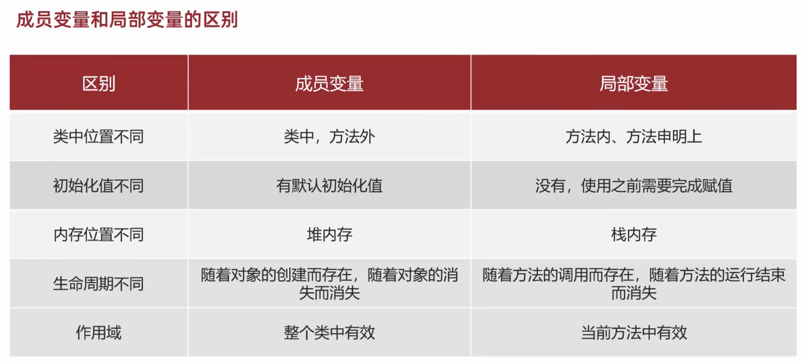

## 构造方法

**inteillj IDE 有个插件ptg有功能直接创建所有构建函数**

是指在class内，在创建对象的时候给成员变量进行赋值的。
1. 方法名与类名相同，大小也要一致
2. 没有返回值类型，连void都不能写
3. 没有具体的返回值（不能由return返回结果数据）
4. 如果没有写任何构造函数，虚拟机会默认一个空参构造函数。

```JAVA
// Student class
public class Student(){
    // 一下两个变量是private的变量，只能由class内的方法调用。
    private String name;
    private int age;
    //构造方法
    public Student(){
        // 空参构造方法
    }
    public Student(String name, int age){
        this.name = name;// 带参构造方法
        this.age = age; // 带参构造取代了下面的赋值函数。
    }

    public String getName(){
        return name;
    }
    public void setName(String name){
        this.name = name;
    }
    public int getAge(){
        return age;
    }
    public void setAge(int age){
        this.age = age;
    }
}
```

