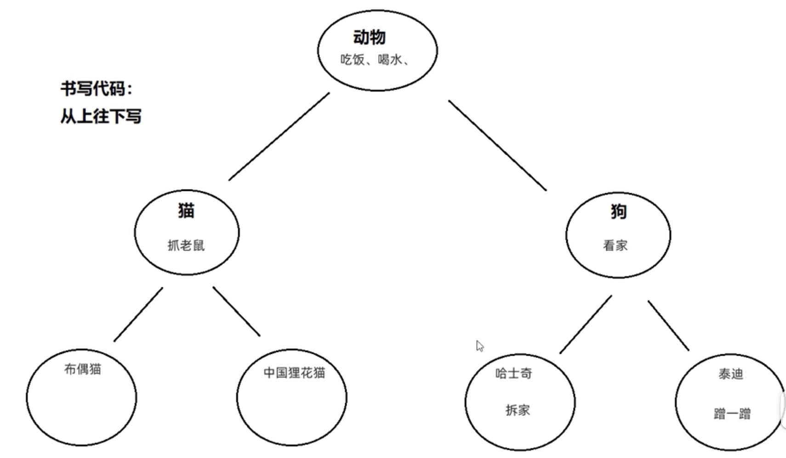

[返回目录](./1.%20java学习目录.md)

## 继承 inherent

### Object 代表什么？  
object就是封装对应的数据，并提供数据对应的行为。理解起来还是有点飘渺的，结合实际就是。
1. 将需要处理的数据，在一个class文件中列出，成为该object的一个attribute。
2. 对该attribute的获取是 get function，修改是 set function，这就是对应的行为。
3. 一个class中所有attribute and function的结合成一个整体，就是一个object。
4. object的list就是对象的集合。

### 如果不同的class有多个相同的attibute怎么办？
使用java继承的逻辑从parent class 继承相应的attribute
1. java 关键字 `extends` 让两个class建立起继承关系。
    `public class Student extends Person{}`
2. Student 称为 child class，Person 为 parent class。
3. Java只支持单继承，也就是一个class只能继承一个class，不能从多个class继承。
4. 继承可以是多层的，也就是一个parent class可以有多个child class，而child class也可以有多个child class。
5. Java中所有的class都直接或间接继承与Object class。

### 什么时候使用继承？  
当multiple class之间存在共性内容，并且child class是 parent class的一种，就可以考虑继承来优化代码。

**实例 - 一个继承关系图：**

```Java
//Parent class
public class Animal {
    public void eat(){
        System.out.println("eat");
    }
    public void drink(){
        System.out.println("drink");
    }
}

// first level child class
public class Dog extends Animal{
    public void Crash(){
        System.out.println("crash home");
    }
}

// second level child class
public class husky extends Dog {
    public void watch(){
        System.out.println("看家");
    }
}

// main class
    public static void main(String[] args) {
        husky a = new husky();
        a.eat();
        a.drink();
        a.Crash();
        a.watch();
    }
```
husky 是 Dog的child，Dog是Animal的Child，所以Husky可以使用所有在Animal和Dog class内的方法和属性。

### child class 能继承哪些内容？
1. 构造方法: 夫类本身的构造函数不能继承。
2. 成员变量: 成员变量就像object的attribute，所有attribute都能被child class继承
3. 成员方法: 只能继承`public`,  不能继承`private`

### 继承的属性和本地属性的层级关系
在main 函数调用方法时，方法对属性和方法的查找顺序是就近查找，先从本身函数范围内，再往class内，再往parent class找。  
如果在不同位置parent 和 child class有属性重名，则可以使用一下方式来选择不同位置的变量。
```Java
// Parent
public class Animal {
    String name = "fu";}

// Child
public class Cat extends Animal{
    String name = "child";
    public void Catch(){
        String name = "zi";
        System.out.println(name);       // 这条显示的是方法内的变量；zi
        System.out.println(this.name);  // 这条显示的是class内的变量：child
        System.out.println(super.name); // 这条显示的是parent的变量：fu
    } 
}
```
但继承关系中，只能使用一个`super`也就是说只能向上一层要求同名变量。

**继承可以在子类中重写父类的方法，重写的方法上放需要写上`@Override`，这个是重写注解，JVM会自动检查**


### child 构造函数
子类构造方法默认先访问父类中的无参构造，再执行自己。  
所以子类构造方法的第一行默认都是： `super()`  
不写也存在，且必须是第一行。 如果想调用父类的有参构造方法，必须手动写 `super(参数)`  