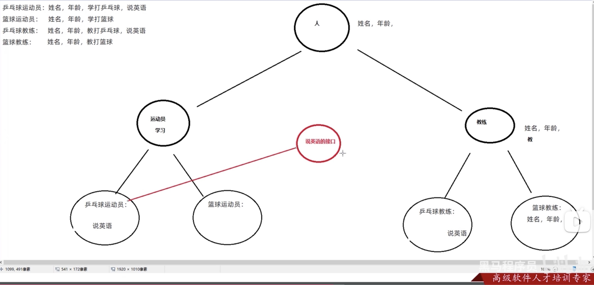

[返回目录](./1.%20java学习目录.md)

## 抽象类
当child没有重载和重写parent的method function，但又需要child自己重写却没有重写的情况下。
就把父类和父类的方法都修饰为抽象方法：
```java
public abstract class Person{
    //抽象类中的抽象方法，子类必须重写。否则会报错
    public abstract void work();
}
```
1. 抽象类不能创建对象。
2. 抽象类不一定有抽象方法，但抽象方法必须在抽象类内
3. 抽象类可以有构造方法：虽然自己不能创建对象，但子类可以调用。
4. 抽象类的子类：要么重写抽象类内所有方法，要么子类本身也是抽象类

## API 接口
如何定义一个接口？
```java
public interface API_name{}
```
1. 接口不能实例化
2. 接口和class之间是实现关系，通过implements关键字表示
   ```java
    public class class_name implements API_name{}
   ```
3. 接口的子类：要么重写接口中的所有抽象方法，要么就是抽象类。
   
注意1: 接口和类的实现关系，可以单实现，也可以多实现。 
```java
   public class 类名 implements API1，API2{}
```  
注意2: 实现类还可以在继承一个类的同时实现多个接口
```java
   public class 类名 extends Parent implements API1，API2{}
```  

==Example：==
```java
    // Parent abstract class
    public abstract class Animal{
        private String name;
        private int age;
        // 还有构造和get/set

        public abstract void eat();
    }

    // API class
    // API class新建的时候选择的是interface，而不是class
    public interface Swim{
        public abstract void swim();
    }

    // implementation class
    public class Rabbit extends Animal{
        /* 构造方法 不高兴写了*/
        // 不继承API接口，只重写parent class的方法
        @Override
        public void eat(){
            System.out.println();
        }
    }

    public class Forg extends Animal implements Swim{
        /* 构造方法不高兴写了 */
        @Override
        public void eat(){
            // 重写父类抽象方法
        }
        @Override
        public void swim(){
            //重写API抽象方法。
        }
    }
```

### 接口中成员的特点
* 成员变量：只能是常量。默认修饰符：`public static final`
* 构造方法：接口没有构造方法。
* 成员方法：只能是抽象方法，默认修饰符：`public abstract`
实际上，jdk9以后是可以写其他方法的。

Example：

设计可以有多种思路，核心思路是让程序逻辑简单化，可读性高，内存占用小

### 接口成员方法
* 接口的成员方法一般都是 **`abstract`** 修饰。
* JDK8 为了更新接口的功能，增加了 **`defualt`** 修饰符，`defualt`允许API定义默认方法。
  * 格式：`public default 返回类型 function_name(reference){}`
  * 默认方法不是抽象方法，不强制重写。但如果重写，要去掉`default`关键字。
  * 如果implements多个API，且API中具有同名默认方法，继承时必须重写
* 允许添加静态方法，用static修饰
  * 格式：`public static 返回类型 function_name(){}`
  * 静态方法只能通过接口名调用，不能通过实现类名或者对象名调用
* JDK9接受私有方法
  * 格式：`private 返回类型 function_name(){}`
  * 格式：`private static 返回类型 function_name(){}`
  * 

       