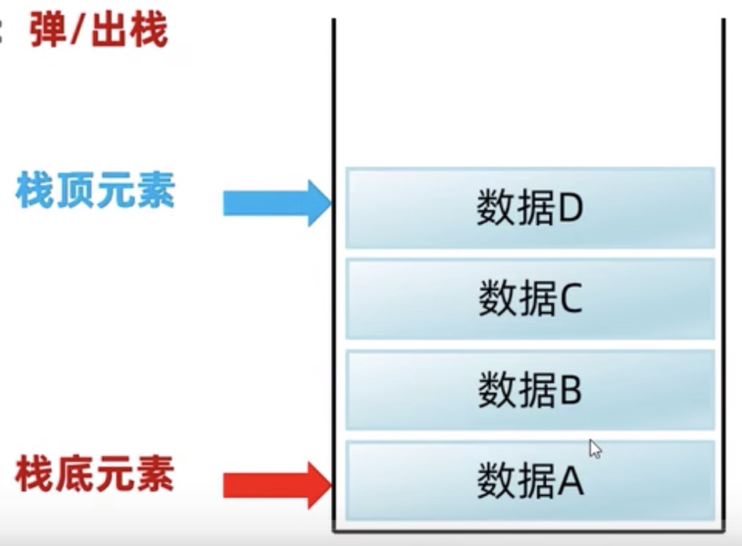
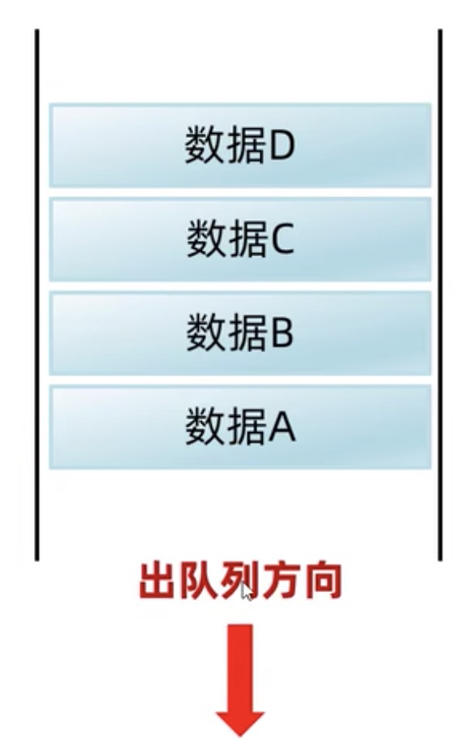
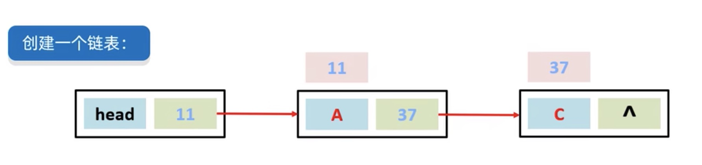
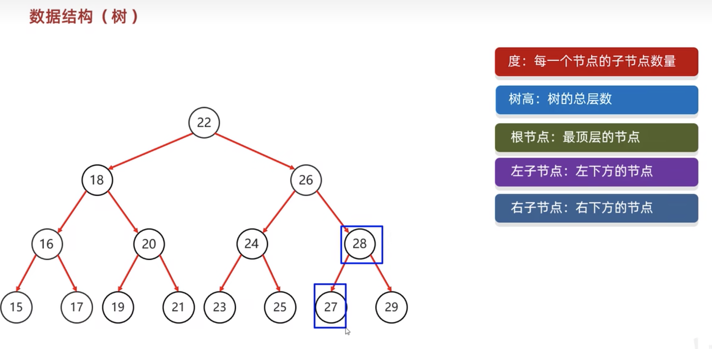

[返回目录](./1.%20java学习目录.md)

# 数据结构

## 数据结构的概述
数据结构是计算机底层存储、组织数据的方式。
是指数据相互之间是以什么方式排列在一起的。
**数据结构的核心：不同类型的数据储存使用不同的类型，能够带来更高的效率**

1. Stack
2. Queue
3. Array
4. Linked List
5. Tree
6. Graph

## Stack 栈
**先进后出，后进先出**
Stack 栈，这个储存像一个瓶子，先储存入的数据被放在瓶底，如果他有新的数据进入，会将老的数据压在栈的底部。必须让新数据先移除，老数据才能读取。
所以是==先进后厨，后进先出==


## Queue 队列
**先进先出，后进后出**
Queue 队列，就像一个通道，先进入的数据，从前端先出去，最后进入的数据，最后出去。


## Array 数组
查询任意数据速度是一样的（通过索引定位），但删除数据时后方所有数据会前移，耗损比较大。中间添加元素也是如此。

## Linked List 链表

1. 创建一个表头 head，head->next为null
2. 当head->next 和 A的地址相连接，整个linked list 就是head，head->A, A->next. 以此类推
3. 链表因为是顺序链接关系，所以不能通过索引的方式查找，所以查找很慢。
4. 因为链表的连接性是靠 ->next 的地址来链接，所以能很方便的通过更改链接地址来在中间添加删除数据，而不用更改其他的数据。
5. 链表分单向链表和双向链表，双向链表： pre <- data -> next

## Tree

Tree的数据储存，遵循一个规则，小的存左边，大的存右边。如果在储存位有数据，则将储存位的数据当父节点，再次遵循左小右大的规则储存。
查找数据也是遵循这个规则，将数据和节点数据对比。

Tree和之前的linked List等不同，他不是直接代码给你的一个储存机制，而是一种储存思路，底层结构是数组还是链表。

```java
//创建一个TreeNode类代表节点
public class BinarySortTree {	
	// Definition for a binary tree node.
	public class TreeNode {
		int val;
		TreeNode left;
		TreeNode right;
		TreeNode() {}
		TreeNode(int val) {
			this.val = val;
		}
		TreeNode(int val, TreeNode left, TreeNode right) {
			this.val = val;
			this.left = left;
			this.right = right;
		}
	}
	TreeNode root; // 新建根节点
}
```

```java
    //根据数组的元素直接创建二叉树
    public void createTree(int[] nums) {
    	root = new TreeNode(nums[0]); // 数组第一个为根节点
        for (int i = 1; i < nums.length; i++) { // 从第二个元素开始迭代
            TreeNode treeNode = new TreeNode();
            treeNode.val = nums[i];            
            TreeNode currentNode = root; // 要插入位置的节点，初始为root，从根节点依次寻找
            TreeNode parentNode = null; // 要插入位置的父节点
            while (currentNode != null) {
            	parentNode = currentNode;
            	if (currentNode.val > nums[i]) { // 当前节点比将要插入的值大
            		currentNode = currentNode.left; // 与根节点左子树比较
            		if (currentNode == null) { // 若左节点为空 则直接插入即可
            			parentNode.left = treeNode;
            			System.out.println(nums[i] + " has been inserted into the binary tree!");
            			break;
            		}
            	} else if (currentNode.val < nums[i]) { // 当前节点比将要插入的值小
            		currentNode = currentNode.right; // 与根节点右子树比较
            		if (currentNode == null) { // 若右节点为空 则直接插入即可
            			parentNode.right = treeNode;
            			System.out.println(nums[i] + " has been inserted into the binary tree!");
            			break;
                    }
            	} else {
            		System.out.println(nums[i]+" repeats!");
            		break;
                }
            }            
        }
    }
```

```java
    //在二叉搜索树中插入节点
    public void insert(int val) {
    	TreeNode treeNode = new TreeNode();
    	treeNode.val = val;
    	if (root == null) { // 如果根节点为空，说明是个空树
    		root = treeNode;
    		System.out.println(val + " has been inserted into the binary tree!");
    	} else {
    		TreeNode currentNode = root; // 要插入位置的节点，初始为root，从根节点依次寻找
			TreeNode parentNode = null; // 要插入位置的父节点
    		while (currentNode != null) {
    			parentNode = currentNode;
    			if (currentNode.val > val) { // 当前节点比将要插入的值大
    				currentNode = currentNode.left; // 与根节点左子树比较
    				if (currentNode == null) { // 若左节点为空 则直接插入即可
    					parentNode.left = treeNode;
    					System.out.println(val + " has been inserted into the binary tree!");
    					break;
    				}	
    			} else if (currentNode.val < val) { // 当前节点比将要插入的值小
    				currentNode = currentNode.right; // 与根节点右子树比较
    				if (currentNode == null) { // 若右节点为空 则直接插入即可
    					parentNode.right = treeNode;
    					System.out.println(val + " has been inserted into the binary tree!");
    					break;
    				}
    			} else {
    				System.out.println(val + " repeats!");
    				break;
    			}
    		}
    	}
    }   
```

```java
    //查找与val数值相等的节点
    public void get(int val) {
    	TreeNode currentNode = root;
    	TreeNode findTreeNode = new TreeNode();
    	while (currentNode != null) {
			if (currentNode.val > val) { // 当前节点比将要插入的值大
				currentNode = currentNode.left; // 去根节点左子树中继续寻找
			} else if (currentNode.val < val) { // 当前节点比将要插入的值小
				currentNode = currentNode.right; // 去根节点右子树中继续寻找
			} else if (currentNode.val == val)  {
				findTreeNode = currentNode; //相等，则currentNode是要寻找的节点。
				System.out.println(findTreeNode.val + " has been found!");
				return;
			}
    	}
    	System.out.println("Error! " + val + " does not exist!");
    }  
```

```java
    /*
    4.删除与val值相同的节点
    由于是二叉搜索树，删除共三种情况
    1 该节点是叶子节点
    2 该节点有一个叶子节点
    3 该节点有两个叶子节点
    */
    public void remove(int val) {
    	TreeNode currentNode = root;
    	TreeNode parentNode = null; // 要插入位置的父节点
		boolean isLeftChild = false; // 判断是父节点的左子树还是右子树
		TreeNode findTreeNode = new TreeNode();
		//寻找删除的节点
    	while (currentNode != null && currentNode.val != val) {
    		parentNode = currentNode;
			if (currentNode.val > val) { // 当前节点比将要插入的值大
				currentNode = currentNode.left; // 去根节点左子树中继续寻找
				isLeftChild = true;
			} else if (currentNode.val < val) { // 当前节点比将要插入的值小
				currentNode = currentNode.right; // 去根节点右子树中继续寻找
				isLeftChild = false;
			}
    	}
    	findTreeNode = currentNode;
    	
//    	System.out.println(currentNode.val + " has been find!");
    	// 1 如果该节点是叶子节点，只用将其叶子节点删掉即可。
    	if (currentNode.left == null && currentNode.right == null) {
    		if (currentNode == root) { // 是根节点，即该树只有一个节点
    			currentNode = null;
    		} else if (isLeftChild) { // 是其父节点的左子树节点
    			parentNode.left = null;
    		} else if (!isLeftChild) { // 是其父节点的右子树节点
    			parentNode.right = null;
    		}
    	} else if(currentNode.left != null && currentNode.right == null) {
    	// 2 该节点有一个叶子节点，叶子结点为左节点
    		if (currentNode == root) { // 是根节点，即该树只有一个节点
    			currentNode = currentNode.left;
    		} else if (isLeftChild) { // 是其父节点的左子树节点
    			parentNode.left = currentNode.left;
    		} else if (!isLeftChild) { // 是其父节点的右子树节点
    			parentNode.right = currentNode.left;
    		}
    	} else if(currentNode.left == null && currentNode.right != null) {	
    	// 2 该节点有一个叶子节点，叶子结点为右节点
    		if (currentNode == root) { // 是根节点，即该树只有一个节点
    			currentNode = currentNode.right;
    		} else if (isLeftChild) { // 是其父节点的左子树节点
    			parentNode.left = currentNode.right;
    		} else if (!isLeftChild) { // 是其父节点的右子树节点
    			parentNode.right = currentNode.right;
    		}
    	} else {
    	// 3 该节点有两个叶子节点
    	//删除节点用左子树中最大值结点（前驱节点）代替，或右子树最小值节点（后继节点）代替
    		// 寻找右子树最小值节点，即后继节点
    		TreeNode successorNode = currentNode; // 后继节点
    		TreeNode successorParent  = currentNode; // 后继节点的父节点
    		TreeNode rightCurrentNode  = currentNode.right; // 先进入当前节点的右子树
    		while (rightCurrentNode != null) {
    			successorParent = successorNode;
    			successorNode = rightCurrentNode;
    			rightCurrentNode = rightCurrentNode.left; // 寻找右子树的左子树（寻找最小值）
    		}
    		//successorNode的左子树成为其父节点的右子树
    		// 然后其右子树更新指向currentNode的右子树
    		if(successorNode != currentNode.right) {
    			successorParent.left = successorNode.right;
    			successorNode.right = currentNode.right;
    		}
    		
    		// 开始删除
    		if (currentNode == root) { // 是根节点，即该树只有一个节点
    			currentNode = successorNode;
    		} else if (isLeftChild) { // 是其父节点的左子树节点
    			parentNode.left = successorNode;
    		} else if (!isLeftChild) { // 是其父节点的右子树节点
    			parentNode.right = successorNode;
    		}
    		successorNode.left = currentNode.left; // 更新左节点
    	}
    	System.out.println(findTreeNode.val + " has been removed!");
    	
    }
```

```java
//二叉树的先序遍历
	public void preOrderTraversal (TreeNode root) {
		if (root == null) {
			return;
		}
		System.out.print(root.val + " "); //先输出当前节点（初始的时候是root节点）
		preOrderTraversal(root.left); // 如果左子节点不为空，则递归继续前序遍历
		preOrderTraversal(root.right); // 如果右子节点不为空，则递归继续前序遍历
	}
```

```java
//二叉树的中序遍历
	public void inOrderTraversa (TreeNode root) {
		if (root == null) {
			return;
		}
		inOrderTraversa(root.left); // 如果当前节点的左子节点不为空，则递归中序遍历
		System.out.print(root.val + " "); // 输出当前节点
		inOrderTraversa(root.right); // 如果当前的右子节点不为空，则递归中序遍历		
	}
```

```java
//二叉树的后序遍历
	public void postOrderTraversal (TreeNode root) {
		if (root == null) {
			return;
		}
		postOrderTraversal(root.left); // 如果当前节点的左子节点不为空，则递归后序遍历
		postOrderTraversal(root.right); // 如果当前节点的右子节点不为空，则递归后序遍历
		System.out.print(root.val + " "); // 输出当前节点		
	}
```

```java
//二叉树的层次遍历
    public void levelOrderTraversal(TreeNode root) {
    	if(root == null) {
    		return;
    	}    	
    	Queue<TreeNode> queue = new LinkedList<TreeNode>(); // 存放每层操作的根节点
        queue.offer(root);        
        while (!queue.isEmpty()) {
            int queueSize = queue.size();
            for (int i = 0; i < queueSize; i++) { // 用for循换可以隔离开每一层的遍历
            	TreeNode rootNode = queue.poll(); // 开始操作后将其从队列移除
            	System.out.print(rootNode.val + " ");
                if (rootNode.left != null) {
    	            TreeNode leftNode = rootNode.left; // 左节点存入队列，下一层遍历它就成了新根节点	            
    	            queue.offer(leftNode);
                }
                if (rootNode.right != null) {
                	TreeNode rightNode = rootNode.right; // 右节点存入队列，下一层遍历它就成了新根节点
                	queue.offer(rightNode);
                }
            }
        }
    }
```
**更多内容在Project文件夹内的[BinarySortTree](./project/Test/src/TreeTest/BinarySortTree.java)文件里
以及[树及其基本操作](https://blog.csdn.net/qq_43647936/article/details/131936792) & [数据结构的树](https://blog.csdn.net/SnailMann/article/details/88570322)**