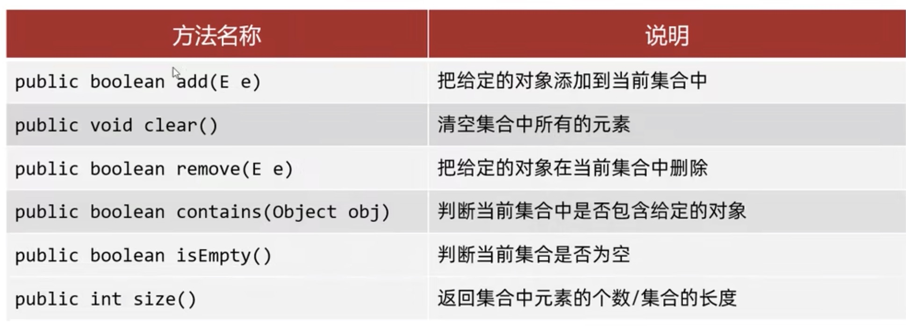
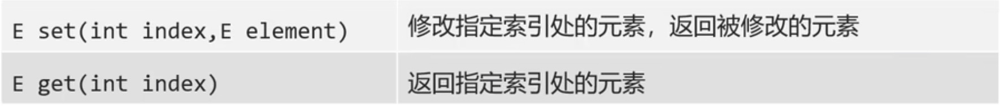
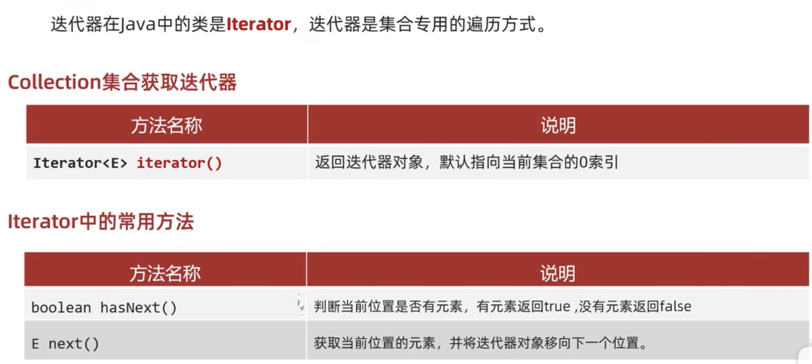
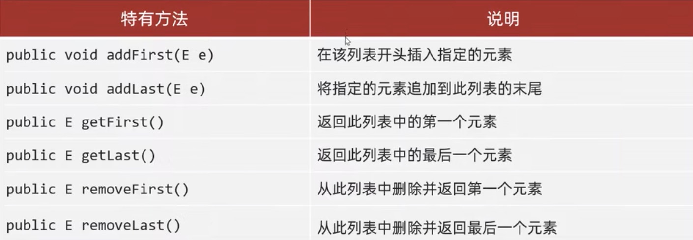
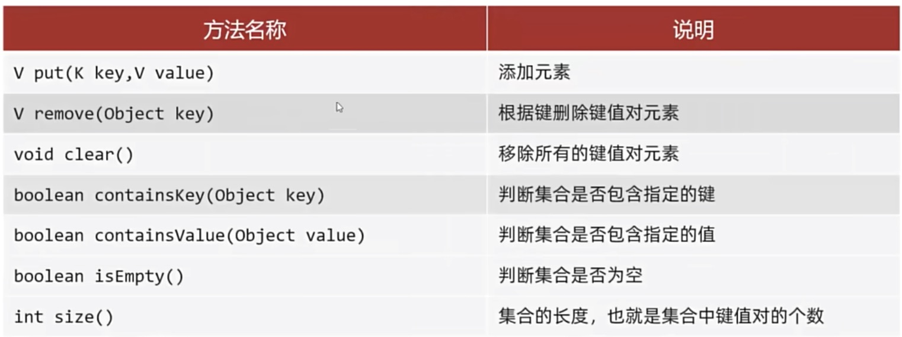
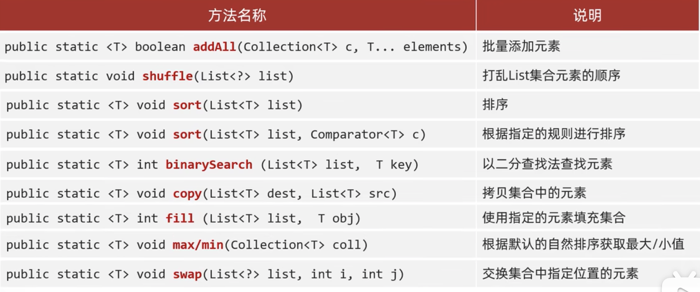

[返回目录](./1.%20java学习目录.md)

# 集合

|大类|分类|实现类
|----|----|----|
|**1. Collection** |**List (API)**|1. ArrayList
|  |  |2. [Linked List](#table1)
|  | **[set (API)](#table4)** |1. [hash set](#table2)
|  |  |2. [tree set](#table3)
|  |  |3. linked hash set
|[Collections](#table11)|（集合工具类）|只适用于Collection集合
|2. **[Map](#table5)**  | 1. [HashMap](#table6)| 2. [LinkedHashMap](#table7)
|  | 3. [TreeMap](#table8) |
|  | [HashTable](#table10) | [Properties](#table9)


### 1. Collection
  **List (API)**: 添加的元素是ordered，duplicate，index

  **[set (API)](#table4)**: unordered, unduplicate, no index


### 通用方法



### 遍历方法


```java
    public static void main(String[] args) {
        List<String> list = new ArrayList<>(); //创建集合
        list.add("this is a test");
        list.add("don't give me again");
        list.add("go to the hell");
        // 1. 迭代器遍历法
        // 创建迭代器，指向collection的头部index
        Iterator<String> it = list.iterator();
        // hasNext()当前位置的下一个是否有元素
        while(it.hasNext()){
            String str = it.next();//返回当前元素，并将迭代器移动到下一格
            System.out.println(str);
        }

        //2. for循环增强版，和python类似的赋值型遍历
        for(String s: list){
            System.out.println(s);
        }

        // Collection 不支持index添加，但是List重写了add方法。可以指定index添加。remove方法也一样。
        list.add(0,"this is bottom");
        // 修改指定元素
        list.set(0,"this is top");
       
        //3. forEach 方法
        list.forEach(new Consumer<String>() {
            @Override
            // Sting s 表示集合中的element
            public void accept(String s) {
                System.out.println(s);
            }
        });

        //4. lambda表达式写法
        list.forEach((String s)->{System.out.println(s);});
        // 并且如果参数只有一个还能简写
        list.forEach(s->System.out.println(s));

        //5. 列表迭代器，用的不多，不写了
    }
```

### <a id="table1">Linked List</a>
Linked List也可以用`add()`方法，结果和`addlast()`是一样的，如果加入index也可以达到当中插入的效果。

```java
    public static void main(String[] args) {
        LinkedList<String> str = new LinkedList<>();
        str.addFirst("i love you");
        str.add("you are my friend");
        str.addLast("this is bottom");
        str.add(2,"this will be third element");

        System.out.println(str.get(2));

        for(String s : str){
            System.out.println(s);
        }
    }
```

### 2. <a id = "table4">Set</a>
set的元素特性：1. 没有索引  2. 元素唯一
```java
        Set<String> s = new HashSet<>();

        boolean r1 = s.add("zhang san");
        boolean r2 = s.add("zhang san");//不可储存，set的元素是唯一的

        System.out.println(r1);
        System.out.println(r2);
        System.out.println(s);
```

但仍然可以用没有索引的方式来遍历。
* 迭代器
* 增强for loop
*  lambda
  
```java
        Set<String> s = new HashSet<>();

        s.add("zhang san");
        s.add("li si");
        s.add("wang er ma zi");
        s.add("fa wai kuang tu");
        //迭代器
        Iterator<String> it = s.iterator();
        while(it.hasNext()){
            String str = it.next();
            System.out.println(str);
        }
        //增强for
        for (String string : s) {
            System.out.println(string);
        }
        //lambda
        s.forEach(str -> System.out.println(str));
```

### <a id="table2">HashSet</a>
哈希是一种增删查改性能较好的一种结构。
底层逻辑是由**array + linked List + 红黑Tree组成**
***哈希值***： `int index = array.length - 1 & hash code `
hashCode的作用是让Hash表的效率更高，所以如果hashset是用来储存object的话，我们需要在object内重写hashCode和equals的方法。否则hash值不会统一。
  ```java
    //object class 内要重写equals和hashCode方法，IDEA有快捷键重写
    @Override
    public boolean equals(Object o) {
        if (this == o) return true;
        if (o == null || getClass() != o.getClass()) return false;
        Student student = (Student) o;
        return age == student.age && Objects.equals(name, student.name) && Objects.equals(gender, student.gender);
    }

    @Override
    public int hashCode() {
        return Objects.hash(name, age, gender);
    }
    //然后就可以在main使用。
    HashSet<Student> ts = new HashSet<>();
  ```

### <a id="table3">TreeSet</a>
   * 对于树脂类型：Integer，Double，默认按照大小排序
   * 对于char/String，按照ASCii码表的升序排列的。
   * 对于object，需要添加排序规则：1. 默认排序  2. 比较器排序
```java
    //在object class中 implement 并重写Comparable方法
    public class Student implements Comparable<Student> { 
        @Override
        public int compareTo(Student o) {
        return this.getAge() - o.getAge();
        }
    }

    //然后就可以在main使用。
    TreeSet<Student> ts = new TreeSet<>();
```

```java
    //也可以不在object class内重写，用比较器排序法，直接在创建TreeSet时用Lambda的方法重写规则
    TreeSet<Student> ts = new TreeSet<>((o1,o2) -> {
        int i = o1.getName().length() - o2.getName().length();
        return i == 0 ? o1.compareTo(o2): i;
        });
```

## 2. <a id = "table5">Map</a>

1. Map类都是成对储存，`key -> value` 的模式。
2. Key 不能重复==can‘t be duplicate==，value 可以重复
3. HashMap，TreeMap，LinkedHashMap
4. **HashMap和TreeMap的源码解析在黑马Java教程第二部中的14-19集，有需要在看**
   
Map是顶层接口，通用方法三个Map都可以使用。



### <a id = "table6">HashMap</a>
1. 无序，不重复，无索引。以上特点是由Key决定的。
2. 和HashSet一样，底层逻辑是HashCode结构。
3. 依赖HashCode和equals方法，保证key的唯一
4. 如果key储存是object，则需要重写hashCode和equals方法

### 通用方法

```java
        //创建map
        HashMap<String, String> hm= new HashMap<>();

        //添加元素
        hm.put("zhang san","male");
        hm.put("li si","female");
        hm.put("wang wu","male");
        //如果通过Put的方法加入相同Key时，value会被新的值覆盖
        hm.put("wang wu", "female")//此时key：wang wu 对应的value：female
        //但put方法不是单纯的覆盖，它其实是弹出原数据的。
        //此段代码会把female再次覆盖为male，但它会把female的值返回给value。
        String value = hm.put("wang wu", "male");
        System.out.println(hm);

        //删除元素
        hm.remove("wang wu");
        System.out.println(hm);

        //判断存在指定key
        System.out.println(hm.containsKey("Kevin He"));

        //判断存在指定value
        System.out.println(hm.containsValue("female"));

        //map 长度
        System.out.println(hm.size());

        //清除所有元素
        hm.clear();
        System.out.println(hm);

        //判断是否empty map
        System.out.println(hm.isEmpty());
```

### 遍历方法
1. 通过Key获取value
2. 依次获取所有的 key->value pair
3. Lambda表达式

```java
        //用set储存key，因为set是不能重复的，而Key也不能重复。
        Set<String> key = hm.keySet();
        for (String s : key) {
            //map_name.get(key), 通过key获取对应的value。
            String v = hm.get(s);
            System.out.println(s + " -> " + v);
        }

        // key->value pair (输入hm.entrySet()后快捷键ctrl alt v）
        Set<Map.Entry<String, String>> entries = hm.entrySet();
        for (Map.Entry<String, String> entry : entries) {
            System.out.println(entry);
        }

        //lambda 遍历Map
        hm.forEach(new BiConsumer<String, String>() {
            @Override
            public void accept(String s, String s2) {
                System.out.println(s + "->" + s2);
            }
        });

        //lambda 简写
        hm.forEach((s,s2) -> System.out.println(s + "->" + s2));

```


### <a id = "table7">LinkedHashMap</a>
1. 有序，不重复，无索引。保证存取的顺序相同。

在HashMap的基础上，添加一条双链表来保证储存数据的顺序。


### <a id = "table8">TreeMap</a>
1. 不重复，无索引，可排序
2. 可排序：对Key进行排序
3. 排序规则：1. comparable接口   2. 创建Map时传递comparator比较器

```java
        //创建map
        TreeMap<Integer, String> tm = new TreeMap<>();

        //可以自行添加排序规则
        TreeMap<Integer, String> tm = new TreeMap<>(new Comparator<Integer>() {
            @Override
            public int compare(Integer o1, Integer o2) {
                return o2.compareTo(o1);
            }
        });

        //Lambda简写法,这个花括号省不掉，不知道为啥
        TreeMap<Integer, String> tm = new TreeMap<>((o1, o2) -> {return o2.compareTo(o1);});

        //添加元素,
        tm.put(1,"Orio");
        tm.put(4, "Sprit");
        tm.put(2, "Master Kang");
        tm.put(5, "Coke Cola");
        tm.put(3, "nine walnut");
        
        //{1=Orio, 2=Master Kang, 3=nine walnut, 4=Sprit, 5=Coke Cola}
        //默认按Key的升序排列
        System.out.println(tm);
```

```java
    public static void main(String[] args) {
        //创建map
        TreeMap<Stu, String> tm = new TreeMap<>();

        Stu s1 = new Stu("zhang san", 22);
        Stu s2 = new Stu("li si", 15);
        Stu s3 = new Stu("wang wu", 17);

        tm.put(s1,"jiang su");
        tm.put(s2,"shang hai");
        tm.put(s3,"bei jing");

        System.out.println(tm);
    }

    // Stu class implements Comparable<Stu>
    // 先通过年龄，在通过名字排序
    @Override
    public int compareTo(Stu o) {
        int i = this.getAge() - o.getAge();
        return i == 0 ? this.getName().compareTo(o.getName()) : i;
    }
```

## <a id="table11">Collections(集合工具类) </a>
java.util.Collections: 是集合工具类

以上方法可食用范围以参数type为准。
* **基本上除了 max/min 和 addAll以外，都只适用于List**