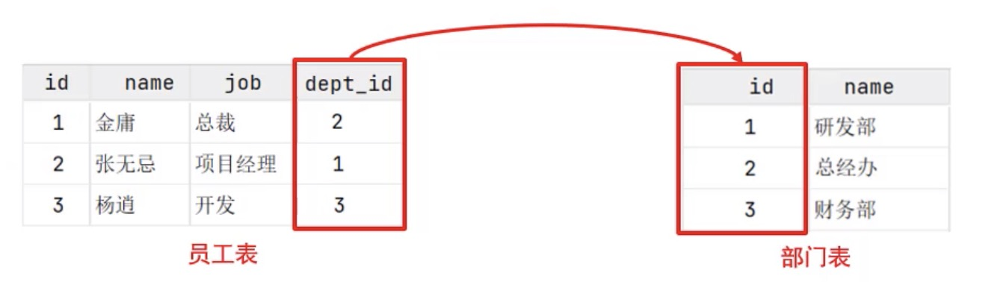

# 数据库相关知识
|[SQL库操作](./2.SQL库操作.md)|[SQL表操作](./3.SQL表操作.md)|[SQL查询](./4.SQL查询.md)|
|--|--|--|
|||

[DBeaver使用](#table1)|[新建表](#table3)|[SQL语句建表](#table2)
|-|-|-|

1. 主要数据库类型：
    | **`Oracle`** | **`MySQL`**  |**`‌SQL Server`**|
    |---|---|---
    |**`PostgreSQL`** |**`IBM DB2`**|**`SQLite`**|
    |**`MongoDB`**|**`Azurs`**| **`MicroSoft Access`**

   `MySQL`和`Oracle`都属于甲骨文，`SQL Server`,`MicroSoft Access`是微软的
    <br>
2. **`SQL`** 是操作**关系型**数据库数据的一种语言。定义了操作关系型数据库的统一标准
      <br>
3. 数据库 **DataBase（DB）**：是存储数据的仓库，数据是有组织的进行存储的
      <br>
4. 数据库管理系统 **DataBase Management System（DBMS）**
   * 上面那些数据库类型其实就是不同的数据库管理系统
   * 不同的数据库类型，其实不是数据库本身不同，而是管理系统管理方式的区别
<br>
1. MySQL官网 Community server里下载mac版，win版很好找
   配置MySQL：
    启动终端，输入：`vim ~/.zshrc` 然后按下 `i` 键，输入
```c#
    #mysql
    export MYSQL_HOME=/usr/local/mysql
    export PATH=$MYSQL_HOME/bin:$PATH
```

按esc键退出Insert模式，然后在英文输入法下输入 `:wq`，退出并保存

然后在终端通过如下代码执行此配置文件。 `% source ~/.zshrc`

执行完以上命令之后，查看MySql版本. `% mysql --version`

输出mysql 版本即代表已经安装配置成功。

进入MySQL: 输入命令, `mysql -u root -p`

以上命令是简化版，完整版为：

`mysql [-h 127.0.0.1][-P 3306]-u root -p`<br>
mysql 命令前缀，两个括号内，一个是host addr，一个是port 端口, root是登陆mysql的用户名，括号内两条命令可省略，port默认为3306

* MySQL应该是默认开机自启的，windows的启动和关闭在cmd内
```c++
    # 启动 windwos命令
    net start mysql80
    # 停止
    net stop mysql80
```

### MySQL命令
必须以“;“作为结尾
(\?) Synonym for `he    lp'.
(\c) 清除当前输入语句.
(\r) 重新连接服务器。可选参数是db和host.
(\d) 设置语句分隔符.
(\e) 使用$EDITOR编辑命令.
(\G) 向mysql服务器发送命令，垂直显示结果.
(\q) 退出mysql.
(\g) 发送命令到mysql服务器.
(\h) 显示帮助信息.
(\n) 禁用分页，打印到标准输出.
(\t) 不要写入outfile.
(\P) 设置pager [to_pager]通过PAGER打印查询结果.
(\p) 打印当前命令.
(\R) 更改mysql提示符.
(\#) 重建完成散列.
(\.) 执行SQL脚本文件。以文件名作为参数.
(\s) 从服务器获取状态信息.
(\!) 执行系统shell命令.
(\T) 设置outfile [to_outfile]。将所有内容附加到给定的输出文件中.
(\u) 使用其他数据库。以数据库名称作为参数.
(\C) 切换到另一个字符集。可能需要使用多字节字符集处理binlog.
(\W) 在每个语句后显示警告.
(\w) 不要在每个语句后显示警告.
(\x) 清除会话上下文.
query_attributes为下一个查询设置字符串参数(name1 value1 name2 value2…)。 
ssl_session_data_print将当前SSL会话数据序列化到标准输出或文件

### 关系型数据库

建立在关系模型基础上，由多张像相互连接的二维表组成的数据库
特点：
1. 使用表存储数据，格式统一，便于维护
2. 使用SQL语言操作，标准统一，使用方便

第一张表的dep_id 对应了第二张表的id，这种将两张表绑定一起的关系，就是关系型数据库

### <a id="table1">DBeaver使用</a>
1. 新连接库：
file -> new -> DataBase connect
然后选择数据库管理类型


输入服务器地址、端口、用户名、密码(数据库自己选填，不填则连接所有数据库），点击“完成”。注：如果首次连接mysql会提示下载对应的JDBC驱动，点击下载即可（这里就不展示了）


连接成功如下图，新建库


2. <a id="table3">新建表</a>
   

输入表名，设置引擎、字符集等

   

依次设定列名和列属性


如下图，新建列成功【其他列同理】


保存表【添加好所有列别忘了保存表和执行SQL哦！】


视图输入列值【点击数据，（右键“编辑”，点击“添加行”）或（点击界面下方箭头处添加）】


输入列值【别忘了保存哦！】，这样一个完整的表就建好啦


3. <a id="table2">SQL语句建表</a>
   对数据库右键SQL编辑器
   

   编辑SQL语句建表，点击方框中小三角形去执行SQL语句（即创建表成功）
   

   刷新即可在导航栏看到用SQL语句创建的表
   

   打开SQL编辑器，编写SQL语句，插入值【一定要记得运行！！！】
   

