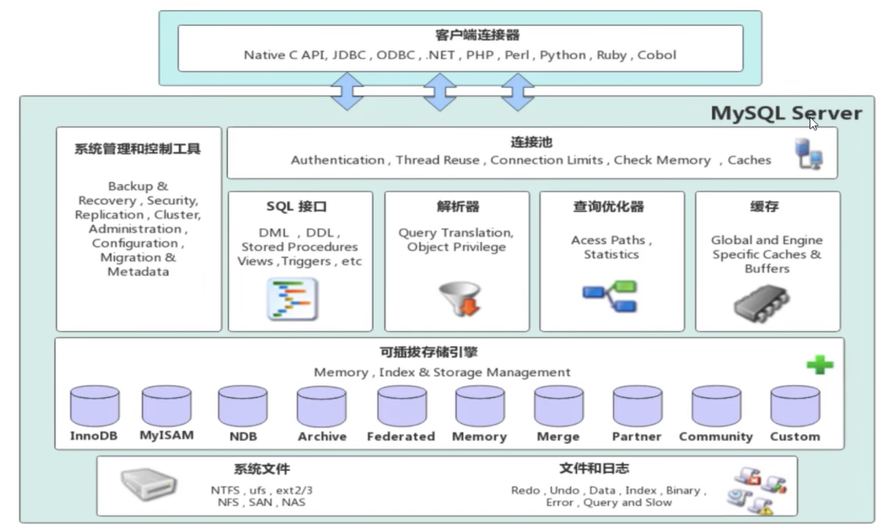

# MySQL进阶

|存储引擎|[索引](./11.索引.md)|[SQL优化](./SQL优化.md)|[视图](./13.View.md)|[触发器](./触发器.md)|
|-|-|-|-|-|
||||||

### 存储引擎

```SQL
-- 查询表的存储类型
SHOW TABLE STATUS FROM Example LIKE 'account';

-- 创建表时默认的ENGINE是innoDB，如果要用别的模式，在表创建的括号后
ENGINE = xxxx [comment]

-- 事后修改
ALTER TABLE 表名 ENGINE = INNODB;
```

1. InnoDB:是Mysql的默认存储引擎，支持事务、外键。如果应用对事务的完整性有比较高的要求，在并发条件下要求数据的一致性，数据操作除了插入和查询之外，还包含很多的更新、删除操作，那么InnoDB存储引擎是比较合适的选择。

2. MISAM : 如果应用是以读操作和插入操作为主，只有很少的更新和删除操作，并且对事务的完整性、并发性要求不是很高，那么选择这个存储引擎是非常合适的。

3. MEMORY:将所有数据保存在内存中，访问速度快，通常用于临时表及缓存。MEMORY的缺陷就是对表的大小有限制，太大的表无法缓存在内存中，而且无法保障数据的安全性。

### 平台搭建

数据库一般建立在linux系统下，我们可以用docker模拟linux系统下的服务器建立。