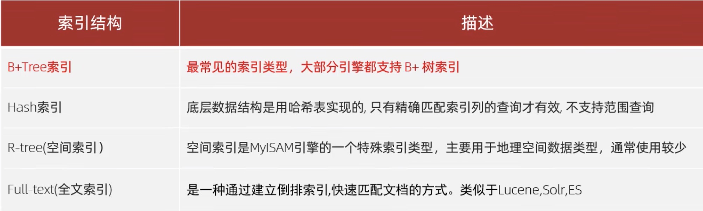
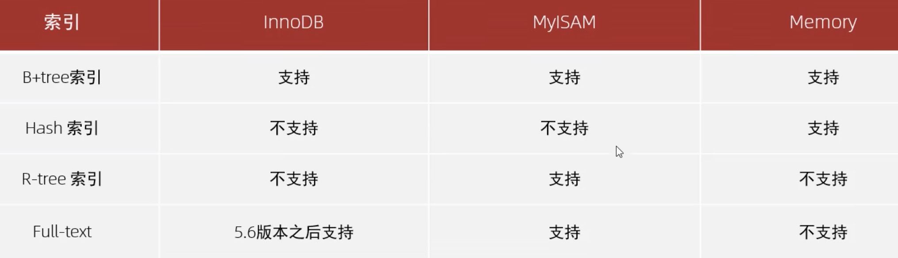
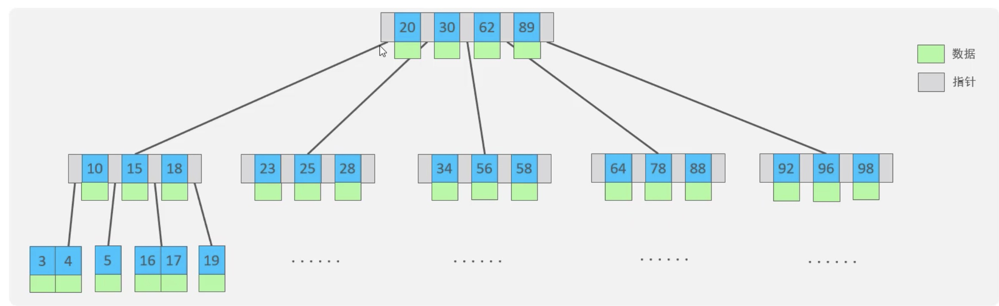
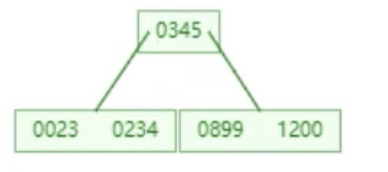
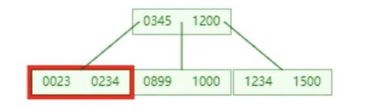
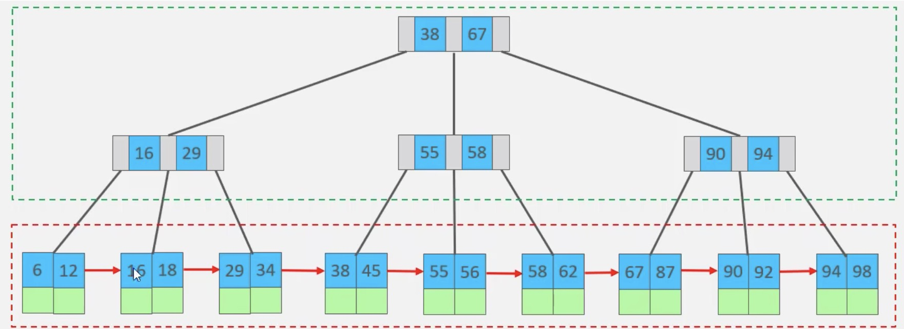
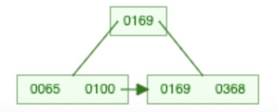
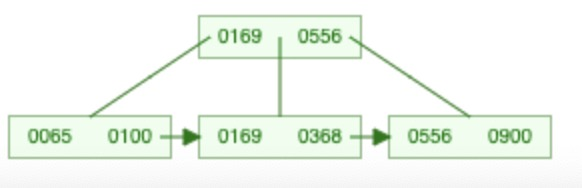
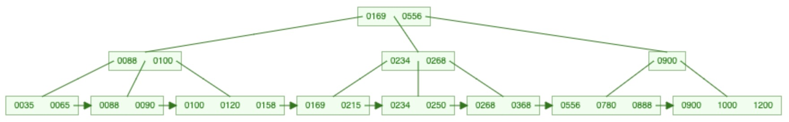

[返回首页](./1.MySQL进阶.md)

# 索引

[B+ tree](#table1)
[hash](#table2)
*索引*（index）是帮助MySQL搞笑获取数据的数据结构（有序）。在数据之外，数据库系统还维护着满足特定查找算法的数据结构，这些数据结构以某种方式引用（指向）数据，这样就可以在这些数据结构上实现高级查找算法，这种数据结构就是索引。

MySQL的索引是在存储引擎层实现的，不同的存储引警有不同的结构，主要包含以下几种

### B-Tree(多路平衡查找树)
以一颗最大度数(max-degree)为5(5阶)的b-tree为例(每个节点最多存储4个key，5个指针)

B tree 二叉树是由下至上开始建立树。
假设，我们有数据`{23,234,345,899,1200,1234,1500,1000}`, 先以这些数据为例  
max.degree = 5, 也就是最大指针节点为5，key数量为4，能储存4个数据。  
1. 前4个数据进入时，平行分布为底层节点。
2. 档1200进入数据时，超过了最大key的要求。
3. 此时，中间节点为345，345作为中间节点提升一阶
   
4. 345作为子节点，小于345的在345左边节点，大于345的在345右边节点，分成两个2key的树杈。
5. 1234 和 1500 进入后，右子叉加入两个key
6. 1000进入时，右子叉超过了key的数量，此时1200成为了中间key。
7. 1200提升一阶，和345同阶。并且在三个指针的对应下将底层树分成3个子节点。
    

### <a id="table1">B+ Tree</a>

B+ tree的所有叶子节点都会在干节点存在。也就是说，b+树的叶子节点会储存所有树的数据，而树只是作为储存结构存在（索引）。并且叶子节点会成为一个单项链表。

以一颗最大度数(max-degree)为4(4阶)的b+tree为例:
1. 数据为 `{100 65 169 368 900 556 780 35 215 1200 234 888 158 90 1000 88 120 268 250}`
2. `100,65,169 `进入时，4阶指针3个key。平行成为叶子节点。
3. 当`368`进入时，超过3个key的标准，中间节点为169，169上升一阶。
4. 叶子节点分裂成 65 100 / 169 368，两个叶子节点。（169升阶，但仍然存在叶子节点中，且65 100节点和169 368 也有节点相连，形成一个单向链表
    
5. 900 进入第二个叶子节点，556进入，超出key数量，这个时候，556距离左边169 差不都有400，距离900 有400，相对平衡且中间的是500 而不是169。所以500向上升一阶。形成三个叶子节点
   
6. 最终tree shape
   

### <a id="table1">Hash 索引</a>
哈希索引就是采用hash算法，将key value 换算成新的hash值，映射到对应的槽位上，然后储存在hash表中

