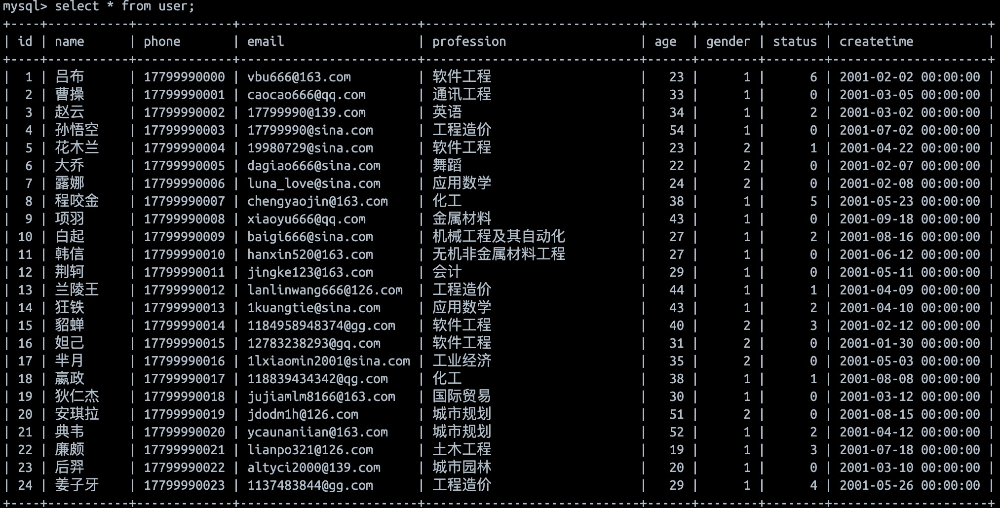
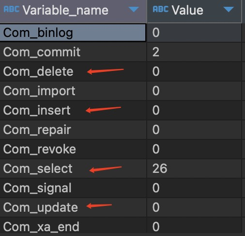

[返回首页](./1.MySQL进阶.md)

# 索引

[B+ tree](#table1)
[索引分类](#table2)
[索引语法](#table3)
[sql性能分析](#table4)
[索引使用](#table5)

***索引***（index）是帮助MySQL搞笑获取数据的数据结构（有序）。在数据之外，数据库系统还维护着满足特定查找算法的数据结构，这些数据结构以某种方式引用（指向）数据，这样就可以在这些数据结构上实现高级查找算法，这种数据结构就是索引。


MySQL的索引是在存储引擎层实现的，不同的存储引警有不同的结构，主要包含以下几种


### B-Tree(多路平衡查找树)
以一颗最大度数(max-degree)为5(5阶)的b-tree为例(每个节点最多存储4个key，5个指针)


B tree 二叉树是由下至上开始建立树。
假设，我们有数据`{23,234,345,899,1200,1234,1500,1000}`, 先以这些数据为例  
max.degree = 5, 也就是最大指针节点为5，key数量为4，能储存4个数据。  
1. 前4个数据进入时，平行分布为底层节点。
2. 档1200进入数据时，超过了最大key的要求。
3. 此时，中间节点为345，345作为中间节点提升一阶
   
4. 345作为子节点，小于345的在345左边节点，大于345的在345右边节点，分成两个2key的树杈。
5. 1234 和 1500 进入后，右子叉加入两个key
6. 1000进入时，右子叉超过了key的数量，此时1200成为了中间key。
7. 1200提升一阶，和345同阶。并且在三个指针的对应下将底层树分成3个子节点。
    

### <a id="table1">B+ Tree</a>

B+ tree的所有叶子节点都会在干节点存在。也就是说，b+树的叶子节点会储存所有树的数据，而树只是作为储存结构存在（索引）。并且叶子节点会成为一个单项链表。


以一颗最大度数(max-degree)为4(4阶)的b+tree为例:
1. 数据为 `{100 65 169 368 900 556 780 35 215 1200 234 888 158 90 1000 88 120 268 250}`
2. `100,65,169 `进入时，4阶指针3个key。平行成为叶子节点。
3. 当`368`进入时，超过3个key的标准，中间节点为169，169上升一阶。
4. 叶子节点分裂成 65 100 / 169 368，两个叶子节点。（169升阶，但仍然存在叶子节点中，且65 100节点和169 368 也有节点相连，形成一个单向链表
    
5. 900 进入第二个叶子节点，556进入，超出key数量，这个时候，556距离左边169 差不都有400，距离900 有400，相对平衡且中间的是500 而不是169。所以500向上升一阶。形成三个叶子节点
   
6. 最终tree shape
   

***为什么InnoDB储存引擎选择使用B+ tree索引结构？***
1. 相对于二叉树，层级更少，搜索效率高;
2. 对于B-tree，无论是叶子节点还是非叶子节点，都会保存数据，这样导致一页中存储的键值减少，指针跟着减少，要同样保存大量数据，只能增加树的高度，导致性能降低;

### <a id="table2">索引分类</a>


***InnoDB中主键索引的B+ tree 高度为多少？***
`n * 8 + （n + 1）* 6 = 16 * 1024`
n代表主键数量，8代表主键占用字节数，16代表一页中能储存的容量为16k
16*1024 代表总字节数量。n+1 代表key数量，6代表key占用的字节数。

结果n为1170个节点，指针为1171个指针
如果 高度为2，存储数据内容差不多为1171 * 16 = 18736 左右

高度为3： 1171 * 1171 * 16


### <a id="table3">索引语法</a>


创建这个表真的是一包三折，SQL语句可以通过代码搞定，但是docker容器不默认支持UTF-8真的搞了很久。
```sql
-- 查看所有索引
show index from exm.`user`;

-- 1. name字段为姓名字段，该字段的值可能会重复，为该字段创建索引。
CREATE index idx_user_name on exm.`user`(name);

-- 这个也可以创建索引
ALTER TABLE user ADD INDEX index_user_name (name);

-- 2. phone手机号字段的值，是非空，且唯一的，为该字段创建唯一索引。
create unique index idx_user_phone on user(phone);

-- 3. 为profession、age、status创建联合索引。
-- 联合索引中字段顺序是有讲究的。
create index idx_user_pro_age_sta on user(profession,age,status);

-- 4. 为email建立合适的索引来提升查询效率。
-- 这是一个简单索引，但实际上email可以和phone一样，作为unique索引
create index idx_user_email on user(email);

-- 5. 删除索引
drop index idx_user_email on user;
```

### <a id='table4'>SQL性能分析工具</a>

* ***SQL执行频率***：增删改查，数据库四大功能中，优化主要集中在“查”

```sql
-- 提供服务器状态信息
show status;

-- 通过指令，可以查看当前数据库的增删改查的访问频次
-- global代表全局状态，session是当前会话状态，Com后面的“_”，一个代表一个字符
show global status like 'Com_______';
```

上面的代码主要针对于查看当前数据库各功能的使用次数。在确认功能使用的频率后针对性的优化。


* ***慢查询日志*** ：查询所有执行时间超过制定参数的SQL语句的日志，默认不开启
```sql
-- MySQL的配置文件(/etc/my.cnf)
-- 查看慢查询是否打开,进入database后查询
show variables like 'slow_query_log';

-- 开启慢日志查询开关，这两段是在/etc/my.cnf里加入的
[mysqld]
show_query_log = 1
long_query_time = 2

-- 关于/etc/my.cnf，我们可以通过vi 或 nano打开查看
-- 但我在docker容器中更改后，并没有成功创建slow_query_log的文件
-- 不懂原因，但可以查看have_profiling参数
select @@have_profiling; -- 查看是否支持
select @@profiling; -- 查看是否打开
set profiling = 1; -- 设定打开

```

### Explain

EXPLAIN 或者 DESC命令获取 MVSOL如何执行 SELECT 语句的信息，包括在 SELECT 语句执行过程中表如何连接和连接的顺序。

```sql
-- 查看索引使用情况
explain select * from user where age > 20;
```


