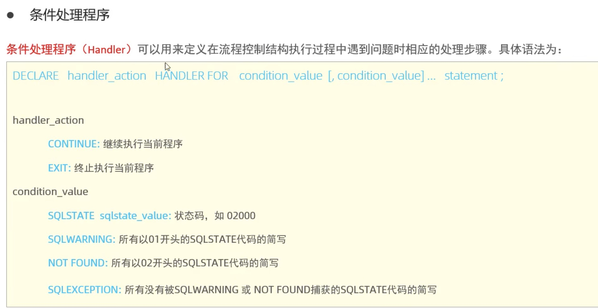

# 视图 & 存储过程

[存储过程](#table1)
[变量](#table2)
[if判断](#table3)
[参数](#table4)
[case](#table5)
[loop](#table6)
[游标](#table7)

```sql
-- 创建视图
create or replace view 自定义名 as select 字段1，字段2，... from 表名 where 搜索条件;

-- 查询视图
show create view 自定义名;

-- 修改视图，可以和创建视图语句一样，主要是replace起作用。
alter view 自定义名 as select 字段1，字段2，... from 表名 where 条件;

-- 删除视图
Drop view if exists 自定义名;
```

### 视图的实际意义
我个人的理解是：
1. 视图是将主表内需要的字段，重新形成一个新的子表。以此来简化一些冗余的字段。
2. 视图可以讲多表查询结合到一张子表之中，省去多表查询的复杂命令

```sql
-- 创建一个视图，形成了一张只有这些字段的子表
create view tb_user_view as select id,name,profession,age,gender,status,createtime from user;

-- 通过view展现表内信息
select * from tb_user_view;
```

### <a id="table1">存储过程</a>

```sql
-- 创建
create procedure 存储过程名称(参数列表)
begin
    -- sql语句
end;

-- 实际案例,运行一下代码后，存储过程保存到数据库
create procedure p1()
begin 
    select count(*) from student;
end;

-- 调用,其实就像函数一样
call p1(); 

-- 查看
-- 1. 查询制定数据库的存储过程及状态信息
select * from information_schema.routines where routine_schema='数据库名称'; -- 注意是数据库，不是表

-- 2. 查询某个存储过程的定义
show create procedure 存储过程名称;

-- 3. 删除
drop procedure [if exists] 存储过程名称;

```

### <a id="table2">存储过程的变量</a>

1. 系统变量
```sql
-- 查看系统变量, session只影响单次会话中的操作，不影响全局。
SHOW [SESSION|GLOBAL] VARIABLE; -- 查看所有系统变量
SHOW [SESSION|GLOBAL] VARIABLES LIKE'...'; -- 可以通过LKE模糊匹配方式查找变量
SELECT @@[SESSION|GLOBAL] 系统变量名;  -- 查看指定变量的值

-- 实例
show variables;
show session variables like 'auto%'; -- 查询所有以auto开头的系统变量
select @@autocommit; -- 明确知道要查询的系统变量名  

-- 设置系统变量
SET[SESSIONIGLOBAL] 系统变量名=值;
SET @@[SESSION|GLOBAL]系统变量名=值;

-- 实例
set session autocommit = 0;
```

2. 自定义变量
```sql
-- 赋值
SET @var name = expr [, @var name = expr]... ,
SET @var name := expr [, @var name := expr]... ,
SELECT @var name := expr [, @var_name := expr] ... ,
SELECT 字段名 INTO @var name FROM 表名;

-- 实例
SET @myname = 'itcast' ;
-- 推荐使用 := 因为sql语句没有 == ，比较运算符也是 = 
SET @myage := 10; 
set @mygender := '男', @myhobby := 'java';

-- 使用
SELECT @myname,@myage,@mygender,@myhobby ; -- 查看变量
SElECT @mycolor := 'red'; -- 仍然是赋值变量
select count(*) into @mycount from user; -- 将count的结果赋值给mycount
```

3. 局部变量

```SQL
create procedure p2()
begin
    -- 局部变量的声明：declare
    declare stu_count int default 0; -- default 可以省略
    select count(*) into stu_count from student;
    select stu_count;
end;

-- 调用
call p2();
```

### <a id="table3">if 判断</a>

```SQL
-- 语法
IF 条件1 THEN
    ...
ELSEIF 条件2 THEN  -- 可选
    ...
ELSE   --可选
    ...
END IF;

-- 案例
create procedure p3()
begin
    declare score int default 58;
    declare result varchar(10);

    if score >= 85 then
        set result := '优秀';
    elseif score >= 60 then
        set result := '及格';
    else
        set result := '不及格';
    end if;
    select result;
end;
```

### <a id="table4">参数</a>
```sql
-- 参数有三种形式，in / out / inout，不指定的话默认为in
-- in 为传入参数，out 为输出参数，inout 为传入输出双向参数
create procedure p3(in score int, out result varchar)
begin

    declare result varchar(10);

    if score >= 85 then
        set result := '优秀';
    elseif score >= 60 then
        set result := '及格';
    else
        set result := '不及格';
    end if; 
end;

-- 调用和接收数据
call p3(68, @result);
select @result;
```

### <a id="table5">case</a>
```sql
-- 季度转换
create procedure p4(month int)
begin
    declare result varchar(10);

    case
        when month >= 1 and month <=3 then 
            set result := '第一季度';
        when month >= 4 and month <=6 then 
            set result := '第二季度';
        when month >= 7 and month <=9 then 
            set result := '第三季度';
        when month >= 10 and month <=12 then 
            set result := '第四季度';
        else
            set result := '非法参数';
    end case;
    -- 等同于print out函数
    select concat('您输入的月份为： ',month,',所属的季度为： '， result)；
end
```

### <a id="table6">循环</a>

```sql
-- while loop, 有条件的循环控制语句，满足后再执行loop中的sql语句
create procedure p7(in n int)
begin
    declare total in default 0;

    while n>0 do
        set total := total + n;
        set n := n - 1;
    end while

end

-- repeat loop, 当满足条件的时候退出循环,等于while do loop
create procedure p7(in n int)
begin 
    declare total int default 0;

    repeat
        set total := total + n;
        set n := n - 1;
    until n <= 0
    end repeat;

end

-- loop, 配合leave退出循环，iterate跳过本次循环
create procedure p8(in n int)
begin 
    declare total int default 0;

    -- sum 是loop的名字。
    sum:loop
        if n <= 0  then
            leave sum;  -- 离开循环
        end if;

        set total := total + n;
        set n := n - 1;
    end loop sum;

    select total;  
end

-- 从1 - n 之间的 偶数之和
create procedure p9()
begin
    declare total int default 0;

    sum:loop
        if n <= 0 then
            leave sum;
        end if;

        if n%2 = 1 then
            set n := n - 1;
            iterate sum;
        end if;
        
        set total := total + n;
        set n := n - 1;
    end loop sum;
end
```

### <a id='table7'>游标</a>
游标(Cursor)是用来存储查询结果集的数据类型，在存储过程和函数中可以使用游标对结果集进行循环处理。游标的使用包括游标的声明，open，fetch和close

```sql
-- 声明游标
DECLARE 游标名称 CURSOR FOR 查询语句;
-- 打开游标
OPEN 游标名称;
-- 获取游标记录
FETCH 游标名称 INTO变量[,变量 ];
-- 关闭游标
CLOSE 游标名称;

-- 实例
create procedure p10(in uage int)
begin
    -- 定义游标，用游标获取结果集
    declare u_cursor cursor for select name,profession from user where age <= uage;

    declare uname varchar(20);
    declare upro varchar(20);

    drop table if exists tb_user;

    create table if not exists tb_user(
        id int primary key auto_increament,
        name varchar(20),
        profession varchar(10)
    );

    -- 打开游标
    open u_cursor;

    -- 循环遍历，获取游标内的结果集
    while true do
        -- 获取游标内的结果进入临时变量
        fetch u_cursor into uname, upro;
        -- 将临时变量的内容插入到数据库
        insert into tb_user values(null, uname, upro);
    end while;

end;

```

### 条件处理程序

上面的实例代码，在while loop处会无限循环，属于逻辑错误
使用条件处理程序可以解决这个问题。

```sql
create procedure p11(in uage int)
begin
    -- 先声明普通变量，再声明游标
	declare uname varchar(20);
    declare upro varchar(20);
	
	-- 定义游标，用游标获取结果集
    declare u_cursor cursor for select name,profession from exm.user where age <= uage;

   	-- 声明条件处理类型
    declare exit handler for SQLstate '02000' close u_cursor;

    drop table if exists exm.tb_user;

    create table if not exists exm.tb_user(
        id int AUTO_INCREMENT primary key ,
        name varchar(20),
        profession varchar(10)
    );
   
       -- 创建一个日志表用于调试
    DROP TABLE IF EXISTS exm.debug_log;
    CREATE TABLE exm.debug_log (
        log_id INT AUTO_INCREMENT PRIMARY KEY,
        log_message VARCHAR(255)
    );

    -- 打开游标
    open u_cursor;

    -- 循环遍历，获取游标内的结果集
    while true do
        -- 获取游标内的结果进入临时变量
        fetch u_cursor into uname, upro;
        -- 将临时变量的内容插入到数据库
        insert into exm.tb_user values(null, uname, upro);
    end while;
	close u_cursor;

end;

call p11(30);
commit;
```

### 存储函数
存储函数用的很少，因为存储函数可以用存储过程替代

函数返回值的存储特性（characteristic说明）：
DETERMINISTIC: 相同的输入参数总是产生相同的结果
NO SQL: 不包含 SQL语句。
READS SOLDATA: 包含读取数据的语句，但不包含写入数据的语句。

```sql
create function fun1(in n int)  -- 声明函数名称和参数
returns int DETERMINISTIC-- 声明返回值类型
begin -- 函数开始
    declare total int default 0;

    while n>0 do
        set total := total + n;
        set n := n - 1;
    end while;

    return total;
end; -- 函数结束

-- 调用
select fun1(10);
```