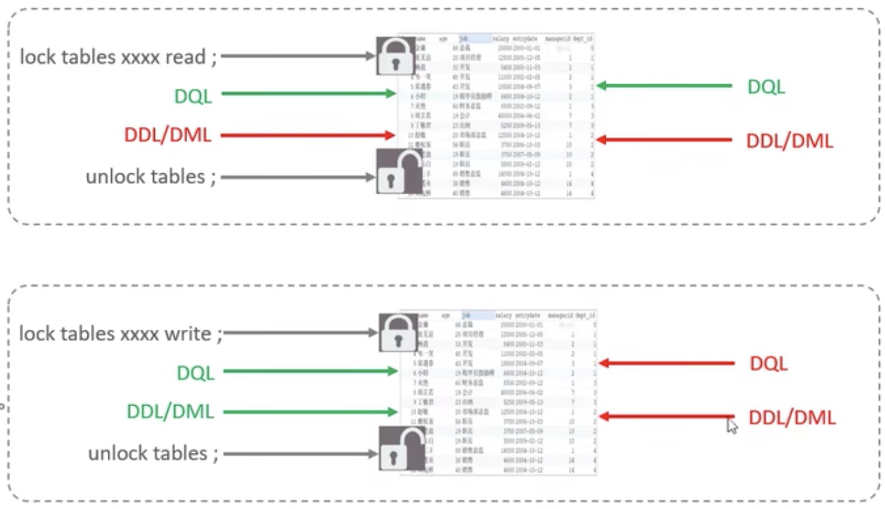
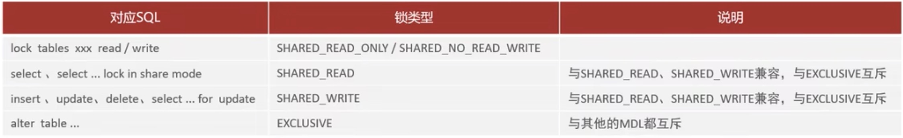

[返回首页](./1.MySQL概述.md)

[表级锁](#table1)
    [元数据锁](#table2)
[MVCC](#table3)

# 锁
锁是计算机协调多个进程或线程并发访问某一资源的机制。在数据库中，除传统的计算资源(CPU、RAM、1/0)的争用以外，数据也是一种供许多用户共享的资源。如何保证数据并发访问的一致性、有效性是所有数据库必须解决的一个问题，锁冲突也是影响数据库并发访问性能的一个重要因素。从这个角度来说，锁对数据库而言显得尤其重要，也更加复杂。

* **其实就是因多用户访问及操作，为了保证多用户在同一时间访问的数据出现问题的解决方案。**

```shell
# 在cmd操作中加入全局锁全局锁，在数据库内使用
mysql > flush tables with read lock;
# 全局锁用于拒绝所有对数据库的写入和修改操作。主要用来备份数据库之前。
# mysqldump 是mysql给的一个工具 不能在数据库内使用该命令
C:\user > mysqldump -uroot -p1234 database_name > D:/db01.sql
# 如果访问的时远程，还需要加入主机地址。
C:\user > mysqldump -h192.168.200.202 -uroot -p1234 表名 > D:/db01.sql
# 解锁
unlock tables;
# 在InnoDB引擎中，我们可以在备份时加上参数 --single-transaction 参数来完成不加锁的一致性数据备份。
C:\user > mysqldump --single-transaction -uroot -p123456 itcast > itcast.sql

```

### <a id='table1'>表级锁</a>
1. 表共享读锁(read lock)
2. 表独占写锁(write lock)
    *   加锁:lock tables 表名... read/write。
    *   释放锁:unlock tables/客户端断开连接。


```sql
-- 表读锁,设置为只读模式，任何客户端的访问都不可进行写入/修改操作
LOCK TABLE table_name READ;
-- 表写锁，当前客户端可读可写，但其他客户端不可读写
LOCK TABLE table_name WRITE;
-- 解锁
UNLOCK TABLES;
```

3. <a id='table2'>元数据锁</a>
   主要作用是维护表元数据的数据一致性，在表上有活动事务的时候，不可以对元数据进行写入操作。为了避免DML与DDL冲突，保证读写的正确性.
   MDL (meta data lock) 加锁过程是系统自动控制，无需显式使用，在访问一张表的时候会自动加上



4. 意向锁
    1. 意向共享锁(IS):与表锁共享锁(read)兼容，与表锁排它锁(write)互斥。
    2. 意向排他锁(IX):与表锁共享锁(read)及排它锁(write)都互斥。意向锁之间不会互斥。

### <a id='table3'>MVCC</a>

1. 当前读
   在InnoDB引擎下，两个客户端分别事务中进行操作是互不影响的。
   也就是说，A的更改操作，B如果在更改前读取了数据库数据，只要事务没有结束，是无法读取到更改后的数据的。
   在这样情况下，可以使用***当前读***。
   
   ```sql
   -- 参考mdl的排斥表，只要是非排斥表的操作，都可以在后面加上lock in share mode，来读取最新的数据
   -- 如果不加 lock in share mode，则为快照读，其实是之前数据的一个快照
   select * from user lock in share mode;
   ```

Multi-Version Concurrency Control （**MVCC**），多版本并发控制。指维护一个数据的多个版本，使得读写操作没有冲突，快照读为MySQL实现
MVCC提供了一个非阳塞读功能。MVCC的县体实现，还需要依赖干数据库记录中的三个隐式字段、undolog日志、readView。


   