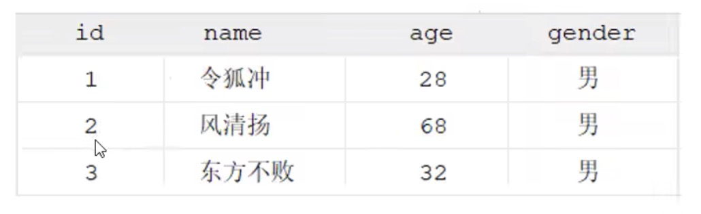

[返回目录](./1.MySQL概述.md)


### SQL 通用语法

1. SQL语句可以单行或多行书写，以分号结尾。
2. 使用空格/缩进增加可读性
3. MySQL中SQL语句不分大小写，关键字建议大写
4. 单行注释： `--` 注释内容 （`#` MySQL独有的）
5. 多行注释： `/* 注释内容 */`
6. 分类：
   

|DLL语句|DML语句|DQL语句|DCL语句|
|-|-|-|-|
|库操作|[添加表数据](./3.SQL表操作.md)|[表内数据查询语句](./4.SQL查询.md)|[用户管理](./5.DCL语句.md)|
|[表创建/查询](./3.SQL表操作.md)|[修改表数据](#table4)|||
|[表修改](#table2)||||


### DDL

1. DDL - 数据库操作
```SQL
    -- 查询： 查询所有数据库
    SHOW DATABASES;
    -- 查询当前数据库
    SELECT DATABASE();
    -- 创建, []内都是可省略的
    CREATE DATABASE [IF NOT EXISTS] 数据库名 [DEFAULT CHARSET 字符集][COLLATE 排序规则];
    -- 删除
    DROP DATABASE[IF EXISTS] 数据库名
    -- 使用,在任意数据库内直接使用该命令即可跳到该数据库内
    USE 数据库名
```

2. DDL - 表操作 - <a id="table1">表创建/查询</a>
```SQL
    -- 查询当前数据库所有表
    SHOW TABLES;

    -- 查询表结构
    DESC 表名;

    -- 查询指定表的建表语句, 显示的就是创建表单每一行的创建标准。
    -- 对照建表和建库创建参数
    SHOW CREATE TABLE 表名;

    -- 创建
    CREATE TABLE 表名(
        字段1 Type[COMMENT 字段1注释],
        字段2 Type[COMMENT 字段2注释],
        字段3 Type[COMMENT 字段3注释],
        ......
        字段n Type[COMMENT 字段n注释]
        )[COMMENT 表注释];
```
创建表单举例：
```SQL
    -- mysql是固定命令，必须空行，不空行会报错失败
    mysql> create table tb_user(
        -- 一行一个字段，也就是一列
        -> id int comment'编号',
        -- string 在 MySQL中是 varchar()，括号中是字符数限制
        -> name varchar(50) comment'姓名',
        -> age int comment'年龄',
        -> gender varchar(1) comment'性别'
        -> );

-- 修改表名
RENAME TABLE tb_user TO user;
```

### 数据类型
编程因为程序所使用的内容相对比较广泛，所以不需要太在意数据类型
但数据库涉及到存储的优化性，数据类型非常重要。

* **数值数据**
  


比如说上面案例的age。现今科学年龄不会超过255这个范畴，所以我们可以使用
```SQL
    AGE TINYINT UNSIGNED comment'无符号小整数值'
    -- double()中的参数为，（数据总长度，小数个数）
    score double(4,1) unsigned comment'成绩无负数'

```
* **字符串数据**
  * blob类型是二进制数据（视频，音频），但性能不高，不方便管理。很少使用
  * text类型是文本数据
  * 主要是char和varchar


**`char`** 是定长字符串，char(10), 如果输入字符少于10，则用空格填补
**`varchar`** 是变长字符串，varchar(10), 输入少于10个字符，则占用空间缩减
但 **`char`** 的性能好，**`varchar`** 性能较差。

* **日期数据**
  


### <a id="table1">表修改</a>
* 约束：
  * PRIMARY KEY (主键): 只能有一个，不能包含空值（NULL），自动创建唯一的索引。
  * UNIQUE KEY (唯一键): 可以有多个，可以包含空值（NULL），且 NULL 值不会被视为重复。
* UNIQUE 约束的用途和特点
确保数据唯一性: UNIQUE 约束保证每一行中的指定列值在整个表中是唯一的。这对于需要保持唯一性的数据非常有用，例如电子邮件地址、用户名等。
允许多个UNIQUE约束: 一个表可以有多个 UNIQUE 约束，每个约束可以在不同的列上定义，或在同一个表中定义多个组合的唯一性。

```sql
    -- 1. 添加字段
    ALTER TABLE 表名 ADD 字段名 TYPE(长度)[COMMENT'注释'][约束]
    -- 添加字段举例
    mysql> alter table emp add nickname varchar(10);

    -- 修改字段
    ALTER TABLE 表名 CHANGE 旧字段名 新字段名 TYPE(长度)[COMMENT'注释'][约束]
    -- 修改字段举例, 这里要注意 ，table后面跟的是表名，不是字段名
    mysql> ALTER table emp change workno workID varchar(10) comment'员工编号';

    -- 修改数据类型
    ALTER TABLE 表名 MODIFY 字段名 new_TYPE(长度)[COMMENT'注释'][约束]
    -- 修改数据类型举例
    mysql> ALTER TABLE emp MODIFY nickname varchar(20);
    -- 修改其他属性通过修改数据类型可以同时修改
    ALTER TABLE emp MODIFY id int unsigned auto_increment NOT NULL;

    -- 每个表单都有一个唯一的序列号，可以理解为index。
    -- 这个index可以设为auto increments，自动增加。
    -- 但有且只能有一个，如果创建时没有设定primary key，后期可以修改。
    ALTER TABLE 表名 ADD PRIMARY KEY(字段);
    -- 修改为PRIMARY KEY, Primary Key在新增时时可以不用手动添加的
    ALTER TABLE `User` ADD PRIMARY KEY(id);
    -- 唯一索引，这个之后了解一下是什么作用
    ALTER TABLE users ADD UNIQUE (id);

    -- 删除字段
    ALTER TABLE 表名 DROP 字段名;

    -- 修改表名
    ALTER TABLE 表名 RENAME TO 新表名

    -- 直接删除表单
    DROP TABLE [IF EXISTS] 表名;

    -- 删除表单，并重新创建一个同名的表单. 
    -- 这种方式，删除的表单内字段会保留，但数据会被彻底删除
    TRUNCATE TABLE 表名;
```


