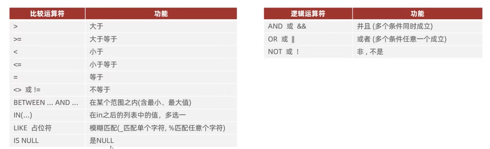

[返回主页](./1.MySQL概述.md)

## DQL查询语言

[基本查询](#table5)
[条件查询](#table6)
[聚合函数](#table7)
[分组查询](#table8)
[排序查询](#table9)
[分页查询](#table10)

|DQL语句编写顺序|DQL语句执行顺序|
|-|-|
|1. `SELECT` 字段列表 | 1. `FROM` 表名列表 |
|2. `FROM` 表名列表 | 2. `WHERE` 条件列表 |
|3. `WHERE` 条件列表 | 3. `GROUP BY` 分组字段列表 |
|4. `GROUP BY` 分组字段列表 | 4. `HAVING` 分组后条件列表 |
|5. `HAVING` 分组后条件列表 | 5. `SELECT` 字段列表 |
|6. `ORDER BY` 排序字段列表 | 6. `ORDER BY` 排序字段列表 |
|7. `LIMIT` 分页参数| 7. `LIMIT` 分页参数 |


### <a id="table5">基本查询</a>
```sql
    -- 查询当前表所有数据
    SELECT * FROM 表名;

    -- 查询指定字段数据
    SELECT 字段1,字段2, ... FROM 表名;
    -- 实例,有些软件可能需要指定到{库名.表名}
    SELECT workID,gender,idno FROM Example.employ e ;

    -- 设置字段别名
    SELECT 字段1[AS 别名1],字段2 [AS 别名2].. FROM 表名;
    -- 好像就是会以别名的方式显示出来而已
    SELECT workID as "员工编号" FROM Example.employ e ;

    -- 去除重复记录
    SELECT DISTINCT 字段列表 FROM 表名;
    -- 只显示某一字段的不重复结果
    SELECT DISTINCT gender FROM Example.employ e ;
```

### <a id="table6">条件查询(WHERE)</a>

```sql
    -- 查询当前表中年龄为30岁的所有数据
    SELECT * FROM employ WHERE age = 30;
    -- 也可以用其他符号
    SELECT * FROM employ WHERE age < 30;
    SELECT * FROM employ WHERE age <= 30;
    SELECT * FROM employ WHERE idno is null;
    SELECT * FROM employ WHERE idno is not null;

    -- 查询指定区间内的数据
    SELECT * FROM employ WHERE age =>15 && age <= 28;
    SELECT * FROM employ WHERE age =>15 AND age <= 28;
    SELECT * FROM employ WHERE age BETWEEN 15 AND 28;

    -- in（）中的条件，只要符合其中之一即算通过。
    SELECT * FROM employ WHERE age in(18,20,40);

    -- 选择多少个字符，一个“_”代表一个字符
    SELECT * FROM employ WHERE name like '__';
    -- %标示前置，不论位数有多少，放前面就是以什么为开头
    -- 就是说这段代码表示以X为结尾的。
    -- 用“_“也行，但有多少位，就要多少”_“
    SELECT * FROM employ WHERE idno like '%X';
```
###  <a id="table7">聚合函数(count、max、min、avg、sum)</a>

将一列数据作为一个整体，进行纵向计算。
**常见聚合函数**
|函数|功能|函数|功能|
|-|-|-|-|
|count|统计数量|max|最大值|
|avg|平均值|min|最小值|
|sum|求和|||

```sql
    -- 记录的就是总数量，不管是哪个字段。
    -- 注意：null值，不参与聚合函数计算。
    SELECT count(*) from employ；

    -- 平均值，最大值，最小值，求和
    SELECT AVG(Age) from employ;
    SELECT MAX(Age) from employ;
    SELECT MIN(Age) from employ;
    SELECT SUM(Age) from employ;

```

### <a id="table8">分组查询(GROUP BY)</a>
```sql
-- 1. 语法
SELECT 字段列表 FROM 表名 [WHERE 条件] GROUP BY 分组字段名 [HAVING 分组过滤条件];
```
上面有两组不同的条件筛选：`WHERE` 和 `HAVING`
* 执行时机不同:where是分组之前进行过滤，不满足where条件，不参与分组;而having是分组之后对结果进行过滤。
* 判断条件不同:where不能对聚合函数进行判断，而having可以。
* 执行顺序： WHERE -> 聚合函数 -> having

```sql
/* 实例：同级不同性别的数量
 select 选两个条目，1个性别，一个统计数量。
 count(*) 因为group by gender被分成两块
 */
SELECT gender, count(*) FROM employ group by gender;

-- 实例：不同性别的平均年龄
-- avg()需要接字段，*代表一行的所有字段。
SELECT gender, AVG(Age) FROM Example.employ e group by gender;


-- 这一段能展现的是同一天入职人数超过3人的日期
-- 显示入职日期，count(*)统计所有条目，age小于45，group by入职日期。
-- 选择统计超过3的条目
SELECT entrydate ,count(*) FROM Example.employ e WHERE Age < 45 GROUP BY entrydate having count(*) > 3
```


### <a id="table9">排序查询(ORDER BY)</a>
```sql
-- 语法
select 字段列表 from 表名 order by 字段1 排序方式1，字段2 排序方式2,...;
```

排序方式： ASC: 升序（默认）
&emsp; &emsp; &emsp; &emsp; &emsp; DESC: 降序

```sql
-- 实例：根据年龄对公司的员工进行降序排序（升序的话desc这部分空着就行）
select * from Example.employ e order by Age DESC;

-- 根据年龄和入职日期排序，年龄升序，入职日期降序
select * from Example.employ e order by age, entrydate desc;
```
注意，当有多个排序条件时，会以第一个排序条件为第一要求，只有在第一个要求相等时，才会去看第二个排序要求。

### <a id="table10">分页查询(LIMIT)</a>
```sql
-- 语法
select 字段 from 表名 limit 起始索引，查询记录数；
```
* 起始索引从“0”开始，起始索引 = （查询页码 - 1） * 每页显示记录数。
* 如果查询的是第一页数据，起始索引可以省略，直接简写为limit 10.

```sql
-- 实例：查询第一页10个员工的所有信息，第一页，身略了起始索引。
SELECT * FROM Example.employ e limit 10;

-- 查询第二页员工数据信息，每页10个员工
-- 起始索引为10，(2-1)*10
SELECT * FROM Example.employ e limit 10,10;
```

* 分页查询是数据库的方言，不同的数据库有不同的实现，MySQL中时limit，其他数据库不是。
  
PostgreSQL & SQLite & DB2: `LIMIT` 和 `OFFSET`
```sql
SELECT * FROM table_name LIMIT row_count OFFSET offset;

--实例：返回从第11行开始的20行数据。
SELECT * FROM employees LIMIT 20 OFFSET 10; 
```

Oracle: `ROWNUM` 或 `FETCH` `FIRST/OFFSET`
```sql
-- 使用ROWNUM
SELECT * FROM (SELECT rownum rnum, t.* FROM table_name t WHERE rownum <= row_count + offset) WHERE rnum > offset;

-- 使用 FETCH FIRST/OFFSET:
SELECT * FROM table_name OFFSET offset ROWS FETCH NEXT row_count ROWS ONLY;

-- 实例：返回从第11行开始的20行数据。
SELECT * FROM employees OFFSET 10 ROWS FETCH NEXT 20 ROWS ONLY; 
```

Microsoft SQL Service: `OFFSET` 和 `FETCH`
```SQL
SELECT * FROM table_name ORDER BY column_name OFFSET offset ROWS FETCH NEXT row_count ROWS ONLY;

-- 实例：返回从第11行开始的20行数据。
SELECT * FROM employees ORDER BY id OFFSET 10 ROWS FETCH NEXT 20 ROWS ONLY; 
```


DQL综合实例代码演示：
```sql
-- 查询性别为 男 ，并且年龄在 20-40 岁(含)以内的姓名为三个字的员工。
SELECT * FROM Example.employ e WHERE gender ="男" and age >= 20 and age <= 40 and name like "___";

-- 注意命令关键字的顺序，年龄小于60岁 ，男性员工和女性员工的人数。
SELECT gender, count(*) from Example.employ e where age < 60 group by gender;

-- 查询所有年龄小于等于35岁员工的姓名和年龄，并对査询结果按年龄升序排序，如果年龄相同按入职时间降序排序。
select name ,age from emp where age <= 35 order by age，entrydate desc;

-- 査询性别为男，且年龄在20-40 岁(含)以内的前5个员工信息，对査询的结果按年龄升序排序，年龄相同按入职时间升序排序。
select * from emp where gender = '男' and age between 20 and 40 order by age asc,entrydate asc Limit 5;
```