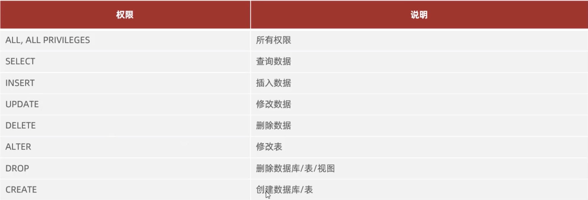

[返回目录](./1.MySQL概述.md)

## DCL语句

DCL英文全称是Data ControlLanquage(数据控制语言)，用来管理数据库 用户、控制数据库的访问权限

### 管理用户

1. 查询用户
```sql
USE mysql;
SELECT * FROM user;
```
用户存储在MySQL数据库中的User table中，定位用户需要host地址和用户名双重定位。

2. 创建用户
```sql
CREATE USER '用户名'@'主机名’IDENTIFIED BY'密码’ ;

-- 实例，只能在本机(localhost)访问数据库但这个命令创造的用户什么权限都没有
CREATE user 'kevin'@'localhost' identified by "123456";

-- 可以在任意主机访问数据库，‘%’ 代表任意主机
CREATE user 'kevin'@'%' identified by "123456";
```

3. 修改用户密码
```sql
ALTER USER'用户名'@'主机名'IDENTIFIED WITH mysql_native_password BY'新密码'

/* 实例，with后面跟的是更改密码的插件，
 * 但是这个插件不同版本的mysql可能会不一样
 * 我们可以提前在cmd中使用 show plugins 来确认mysql使用的是哪个插件
 * 教程中的额插件是：mysql_native_password
 */ 
ALTER USER'kevin'@'localhost'identified with caching_sha2_password BY '654321';
```

4. 删除用户
```sql
DROP USER'用户名'@'主机名';

-- 实例: 删除用户
drop user'kevin'@'localhost';
```

### 权限控制



1. 查询权限
```sql
SHOW GRANTS FOR'用户名'@'主机名';

-- 实例
show grants for 'root'@'localhost';
```

1. 授予权限
```sql
GRANT 权限列表 ON 数据库名.表名 TO '用户名'@'主机名';

-- 实例： * 代表所有
grant all on Example.* to 'kevin'@'localhost'; 
```

1. 撤销权限
```sql
REVOKE 权限列表 ON 数据库名.表名 FROM'用户名'@'主机名';

-- 实例： * 代表所有
revoke all on Example.* FROM 'kevin'@'localhost';
```


