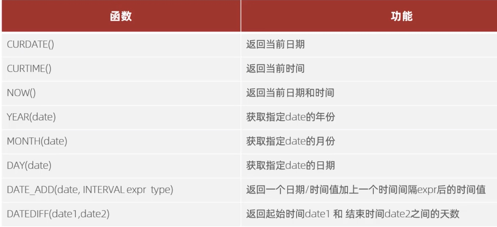
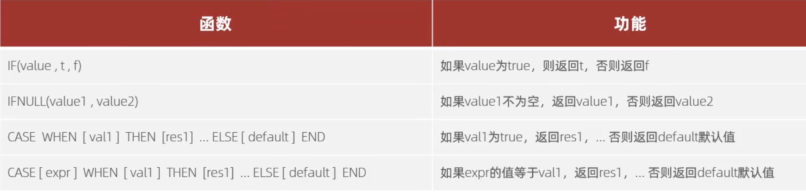

[返回首页](./1.MySQL概述.md)

# MySQL 内置函数
[字符串函数](#table1)
[数值函数](#table2)
[日期函数](#table3)
[流程函数](#table4)

### <a id="table1">字符串函数</a>
|函数|功能|
|-|-|
CONCAT(S1,S2,...Sn)|字符串拼接，将S1，S2，...Sn拼接成一个字符串
LOWER(str)|将字符串str全部转为小写
UPPER(str)|将字符串str全部转为大写
LPAD(str,n,pad)|左填充，用字符串pad对str的左边进行填充，达到n个字符串长度
RPAD(str,n,pad)|右填充，用字符串pad对str的右边进行填充,达到n个字符串长度
TRIM(str)|去掉字符串头部和尾部的空格
SUBSTRING(str,start,len)|返回从字符串str从start位置起的len个长度的字符串

```sql
-- 实例：concat('char/String', ...)
select concat('hello',' MySql') -- output：hello MySql

-- lower: 全部小写
select lower('HELLO A FANYI OK A XIALAI MIXIA');

-- upper：全部大写
select upper('u can u up, no can no bb');

-- lpad(str, str.length, "char") 左填充
select lpad('01',5,'-'); -- output：---01

-- rpad 右填充(str, str.length, "char")
select rpad('01',5,'-'); -- output：01---

--trim(str) 去除头尾空格，中间不算
select trim('     hello  M y loard     ');

-- substring(str, start, end)
select substring('hello my love', '1','5')
```

### <a id="table2">数值函数</a>

|函数|功能
|-|-|
CEIL(x)|向上取整
FLOOR(X)|向下取整
MOD(x,y)|返回x/y的模心
RAND()|返回0~1内的随机数
ROUND(x,y)|求参数x的四舍五入的值，保留y位小数
```sql
-- 实例：CEIL(x) 向上取整
select ceil(1.1)； -- output：2

-- FLOOR(X)：向下取整
select floor(1.9); -- output：1

-- MOD(x,y)：返回x/y的余数，3/4 余数为0，5/4 余数为1
select mod(3,4); -- 3
select mod(5,4); -- 1

-- RAND()|返回0~1内的随机数
select rand(); -- 随机一个小于1的10位小数

-- ROUND(x,y)|求参数x的四舍五入的值，保留y位小数
-- 注意，如果四舍五入最后一位为0，则会不显示。
select round(1.20398, 2);  
```

### <a id="table3">日期函数</a>


```sql
-- 实例：curdate() ,current date 的缩写
select curdate(); -- 当前日期

-- curtime()
select curtime(); -- 当前时间，24小时制

-- now();
select NOW(); -- 当前日期+时间

-- 从日期中获取年月日，且这个日期格式为日期+时间
-- YEAR(date)
select YEAR(now()); 
-- MONTH()
select month(now()); 
-- DAY()
select day(now()); 

-- date_add(date, INTERVAL expr type)
SELECT DATE_ADD(NOW(), INTERVAL 70 month);

-- dateiff(date1,date2)
-- date1 - date2 的差
select DATEDIFF('2021-11-01','2022-01-02');


-- 对数据库 的实际应用
-- 需求：显示所有员工的入职天数，并降序排序
-- 选择显示员工姓名，以及用datediff()函数获得员工入职天数
-- as 给该函数创建的新列取名
-- order by 用取的别名作为order目标。
select name,datediff(curdate(),entrydate) as 'entrydays'from Example.employ e order by entrydays desc;
```

### <a id="table4">流程函数</a>

```sql
-- IF(value ,t, f)


-- IFNULL(value1 , value2)


-- CASE WHEN [val1 ] THEN [res1].. ELSE [ default]END
-- 类似if else，注意最后要加end
SELECT name, (case gender when '男' then '光头佬' when '女' then '小骚逼' else '狗逼' end) as '绰号' FROM Example.employ e;

-- CASE [expr ] WHEN [val1 ] THEN [res1] .. ELSE [ default] END
-- case后不跟字段列，直接将expression当字段列。
-- 最后一个命令不加逗号
SELECT 
	id,
	name,
	(CASE when math >= 85 then '优秀' when math >=60 then '及格' else '不及格' end)'数学',	
	(CASE when english >= 85 then '优秀' when english >=60 then '及格' else '不及格' end)'英语',	
	(CASE when chinese >= 85 then '优秀' when chinese >=60 then '及格' else '不及格' end)'语文'	
FROM Example.score s;

```


