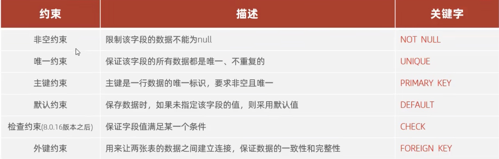
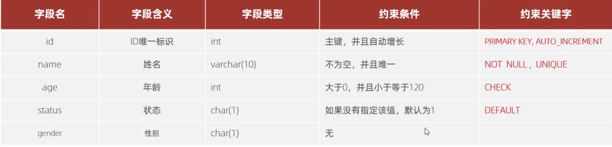
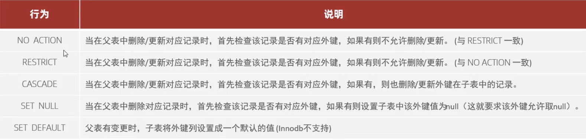

[返回首页](./7.约束.md)

# 约束
[外键约束](#table1)
[外键约束语法](#table2)
[外键更新/删除](#table3)

### 概述
**概念**：约束是作用于表中字段上的规则，用于限制存储在表中的数据。
**目的**：保证数据库中数据的正确、有效和完整性。
**分类**：


**演示**

```sql
 create table Example.stu(
    -- primary key 唯一识别符，auto_increament 自动增长。
 	id int primary key auto_increment comment'id',
    -- not null 不为空，unique 唯一值，不可重复
 	name varchar(10) not null unique comment'姓名',
    -- check（）括号中跟check的条件
 	age int check(age > 0 and age <= 120) comment'年龄',
    -- default 默认值 1.
 	status char(1) default '1' comment'状态',
 	gender char(1) comment'性别'
 );

 -- 正确插入的方式
 INSERT INTO Example.stu (name,age,status,gender) values('Tom',19,'1','男'),('kevin',40,'0','男'),('Angela',40,'1','女');

 -- 错误插入，名字为null，名字重复，年龄为负数 都会报错提示
 INSERT INTO Example.stu (name,age,status,gender) values(null,19,'1','男'),('kevin',40,'0','男'),('cathy',-12,'1','女');
```

### <a id="table1">外键约束</a>
外键用来让两张表的数据之间建立连接，从而保证数据的一致性和完整性。

```sql
-- 实例
-- 创建两张表单
create table Example.emp(
	id int primary key auto_increment,
	name varchar(10),
	age int check(age > 0 and age <=120),
	job VARCHARACTER(10),
	salary double,
	entrydate date,
	managerid int,
	dept_id int
);

INSERT INTO Example.emp (name,age,job,salary,entrydate,managerid,dept_id) 
	values('金庸',66,'总裁',20000,'2000-01-01',null,5),
		('张无忌',20,'项目经理',12500,'2005-12-05',1,1),
		('杨逍',33,'开发',8400,'2000-11-03',2,1),
		('韦一笑',48,'开发',11000,'2002-02-05',2,5),
		('常遇春',43,'开发',10500,'2004-09-07',3,1);

1	金庸	66	总裁	20000.0	2000-01-01		5
2	张无忌	20	项目经理	12500.0	2005-12-05	1	1
3	杨逍	33	开发	8400.0	2000-11-03	2	1
4	韦一笑	48	开发	11000.0	2002-02-05	2	1
5	常遇春	43	开发	10500.0	2004-09-07	3	1

-- 第二张表
CREATE table Example.dept(
	id int primary key auto_increment,
	name varchar(5)
);

INSERT INTO Example.dept (name) values('研发部'),('市场部'),('财务部'),('销售部'),('总经办');

1	研发部
2	市场部
3	财务部
4	销售部
5	总经办
```

### <a id="table2">外键约束语法</a>
```sql
    CREATE TABLE NAME (
        FIELD TYPE,
        ...
        [CONSTRAINT][外键名称] FOREIGN KEY(外键字段名) REFERENCES 主表（主表字段名）
    )

    ALTER TABLE 表名 ADD CONSTRAINT 外键名称 FOREIGN KEY （外键字段名）REFERENCES 主表（主表字段名）

    -- 实例，添加外键，外键的添加都是从子表挂去主表
    -- foreign key后跟本表字段名，references后面跟要链接的表名(字段名)
    ALTER TABLE Example.emp ADD CONSTRAINT fk_emp_dept_id foreign key (dept_id) references dept(id);
    
    -- 建表时直接设立外键
    CREATE table Example.idex(
        id int primary key auto_increment,
        dept_id int,
        CONSTRAINT fk_idex_dept_id foreign key (dept_id) references Example.stu(id) 
    );

    -- 删除外键
    ALTER TABLE 表名 DROP FOREIGN KEY 外键名称; -- 注意这里是外键名称，不是字段名
    ALTER table Example.idex drop foreign key fk_idex_dept_id;
```

### <a id="table3">外键删除/更新行为</a>


```sql
-- 关联两张表的操作更新，UPDATE和DELETE后的命令，分别对应上面图片的功能
ALTER table Example.emp add constraint fk_emp_dept_id foreign key (dept_id) references dept(id) on UPDATE cascade on delete cascade;
```


