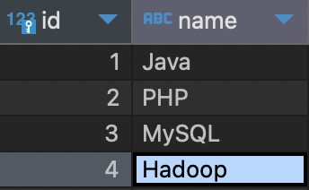
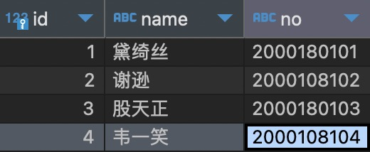
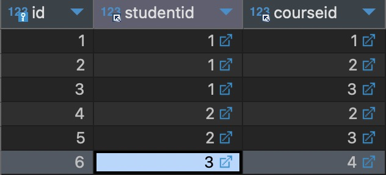
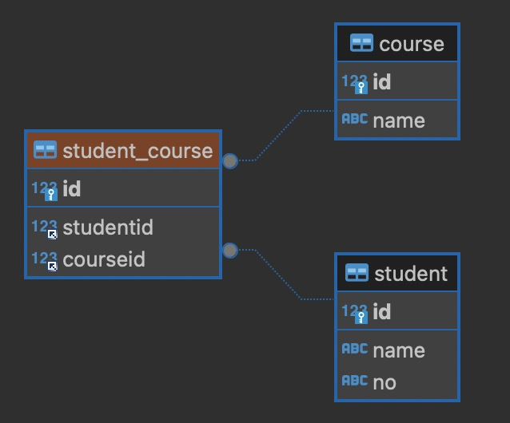
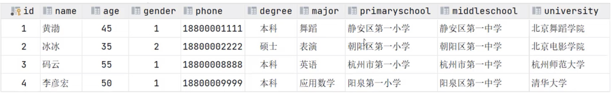
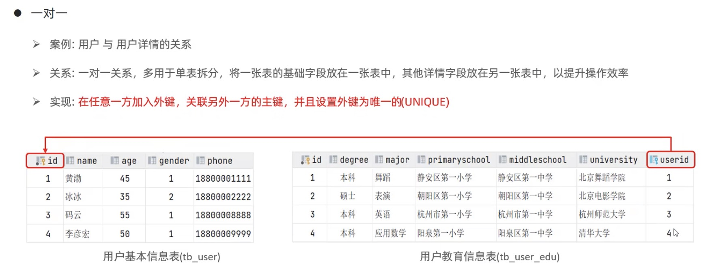

[返回首页](./1.MySQL概述.md)

# 多表查询

[内连接](#table1)
[外连接](#table2)
[自连接](#table3)
[联合查询](#table4)
[子查询](#table5)

### 多 vs 多 关系

数据库关系有些时候会错综复杂，多对多的关系比如学生选课，不同的学生选不同的课，多门课程也可能有不同的学生。

两张表的数据
 

多vs多的情况下，我们需要建立一个中间表以做过度
这个中间表studentid挂载的是student，courseid挂载的是course



### 1 vs 1 

1 vs 1 表主要用来将一张过于庞大的表分拆开来。



### 多表查询概述

* 笛卡尔积：是指在数学中，集合A和集合B的所有组合情况。
* 在多表查询时，需要消除无效的笛卡尔积
```sql
-- DBeaver模式，在加载数据库表时给表加了别名，所以后面用别名调用字段列
select * from Example.emp e , Example.dept d  where e.dept_id = d.id;

-- 普通SQL语法
select * from 表名1 , 表名2  where 表名1.dept_id = 表名2.id;
```

### 多表查询分类
1. 连接查询
    * 内连接:相当于查询A、B交集部分数据
    * 外连接:
      * 左外连接:查询左表所有数据，以及两张表交集部分数据
      * 右外连接:查询右表所有数据，以及两张表交集部分数据
    * 自连接:当前表与自身的连接查询，自连接必须使用表别名

### <a id="table1">内连接查询语法</a>
```sql
-- 隐式内连接
SELECT 字段列表 FROM 表1,表2 WHERE 条件;

-- 内连接演示
-- 1. 查询员工姓名，及内联部门的名称
SELECT e.name, d.name FROM Example.emp e , Example.dept d where e.dept_id =d.id;


-- 显式内连接
SELECT 字段列表 FROM 表1[INNER]JOIN 表2 ON 连接条件;
-- 2. 查询员工姓名，及关联部门名称（显式内连接）。inner可省略
SELECT e.name,d.name FROM Example.emp e inner join Example.dept d on e.dept_id =d.id;
```

### <a id="table2">外连接查询语法</a>

左外连接: 相当于查询表1(左表)的所有数据 包含 表1和表2交集部分的数据

右外连接: 相当于查询表2(右表)的所有数据 包含 表1和表2交集部分的数据

```sql
-- 左外连接
SELECT 字段列表FROM 表1 LEFT [OUTER]JOIN 表2 ON 条件 ..
-- 内连接演示
-- 1. 查询emp表的所有数据，和对应的部门信息。
-- 所谓的左就是信息表，右就是挂载表, outer可以省略
SELECT e.*, d.name FROM Example.emp e left outer join Example.dept d on e.dept_id = d.id;

-- 右外连接
SELECT 字段列表 FROM 表I RIGHT [OUTER]IOIN 表2 ON 条件 ..;
-- 2.查询dept表的所有数据，和对应员工信息
SELECT d.*, e.* FROM Example.emp e right outer join Example.dept d on e.dept_id = d.id;
```

### <a id="table3">自连接查询语法</a>

自连接查询语法: 自连接查询，可以是内连接查询，也可以是外连接查询。

```sql
SELECT 字段列表 FROM 表A 别名A JOIN 表A 别名B ON 条件;

-- 1.查询员工及所属领导的名字。
SELECT e.*, b.* from Example.emp e join Example.emp b on e.id = b.managerid order BY  e.name ;

```

### <a id="table4">联合查询</a>

union：就是把多次查询的结果合并起来，形成一个新的查询结果集。

```sql
SELECT 字段列表 FROM 表A .
UNION [ ALL ]
SELECT 字段列表 FROM 表B .;

-- union all 是不去重的，所以会出现重复数据。union会去重。
-- 在使用union时必须选择同样的字段和表。
SELECT * FROM Example.emp e WHERE salary < 5000
UNION ALL
SELECT * FROM Example.emp e WHERE age > 50;
```

### <a id="table5">子查询</a>

概念:SQL语句中嵌套SELECT语句，称为嵌套查询，又称子查询

`SELECT *FROM t1 WHERE column1=(SELECT column1 FROM t2 );`

子查询外部的语句可以是INSERT/UPDATE/DELETE/SELECT的任何一个。
根据子查询结果不同，分为:
1. 标量子查询(子查询结果为单个值)
2. 列子查询(子查询结果为一列)
3. 行子查询(子查询结果为一行)
4. 表子查询(子查询结果为多行多列)

根据子查询位置，分为: WHERE之后、FROM之后、SELECT之后。

[子查询](./9.子查询.md)


