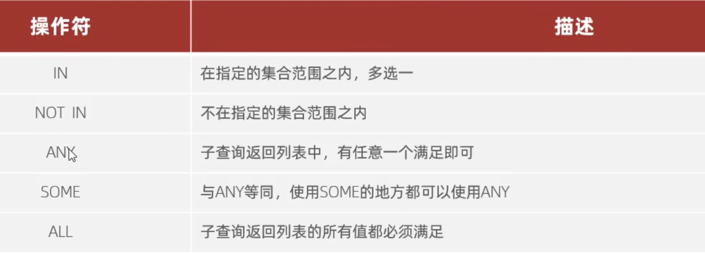

[返回首页](./1.MySQL概述.md)

# 子查询
|标量子查询|[列子查询](#table1)|[行子查询](#table2)|[表子查询](#table2)|

### 标量子查询
子查询返回的结果是单个值(数字、字符串、日期等)，最简单的形式，这种子查询成为标量子查询
常用的操作符:= <> > >= < <=
```sql
-- 等于说把前置条件，作为一个独立的命令加载新的命令中
SELECT * FROM Example.emp e WHERE id = (SELECT id FROM Example.dept d WHERE name = '销售部');

SELECT * FROM Example.emp e WHERE entrydate > (SELECT entrydate FROM Example.emp e WHERE name='东方白');
```

### <a id='table1'>列子查询</a>
子查询返回的结果是一列(可以是多行)
常用的操作符:IN、NOTIN、ANY、SOME、ALL


```sql
-- 1. 查询销售部和市场部所有员工信心
-- a. 查询销售部和市场部的部门ID  b. 根据部门ID，查询员工信息 
-- 注意，这里有两条信息，所以需要用 in
SELECT * FROM Example.emp e WHERE dept_id in (SELECT id FROM Example.dept d WHERE name = '销售部' OR name = '市场部');

-- 嵌套过多的时候建议使用多行编写
SELECT * 
FROM Example.emp e 
WHERE salary > (
	SELECT MAX(salary) 
	FROM Example.emp e2 
	WHERE dept_id in (
		SELECT id 
		From Example.dept d 
		WHERE name = '财务部'
	)
);

-- 还有一种方法，在salary 判断时使用 all () 包裹最后一个嵌套
SELECT *
FROM Example.emp e 
WHERE salary > all(
	SELECT salary 
	from Example.emp e2 
	where dept_id = (
		select id from Example.dept 
			where name = '财务部'));

-- 查询比财务部任何一个人工资高就行。函数方式改为min（），非函数方式改 any
SELECT MAX(salary) 
WHERE salary > any()
WHERE salary > some() -- 和any 效果一样
```

### <a id='table2'>行子查询</a>

```sql
 SELECT * FROM Example.emp e2 WHERE (salary,managerid) in (SELECT salary,managerid FROM Example.emp e WHERE name = '张无忌')
```

### <a id='table3'>表子查询</a>
子查询返回的结果是多行多列，这种子查询称为表子查询

```sql
-- 查询与鹿杖客，宋远桥，只为和薪资相同的员工信息
SELECT * FROM Example.emp e2 WHERE (salary,job)in(SELECT salary,job FROM Example.emp e WHERE name = '鹿杖客' or name = '宋远桥');

-- 查询入职日期是“2006-01-01”之后的员工信息，及其部门信息。
SELECT e2.*, d.* FROM (SELECT * FROM Example.emp e WHERE entrydate > '2006-01-01') e2 LEFT JOIN Example.dept d on d.id = e2.dept_id;
```
