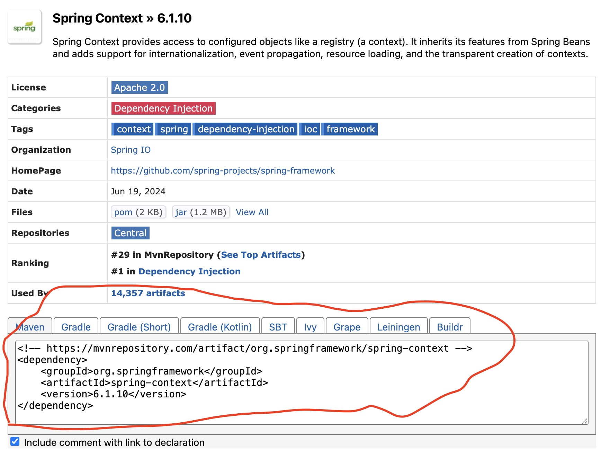

# Spring freamwork

[maven基础](#table1)

### Java项目的搭建结构
1. **实体层**（entity / model / vo）：这部分搭载的是用户或者说软件操作者的data object class
   
2. **逻辑层**（logic / Service）：这部分搭载的是method function的API 和实现类

3. **数据访问层**（Dao）：[详细说明](./3.Dao.md)
   
4. **控制层**（Controller）：
5. **测试层**（Test）：
   

### Spring freamwork
1. Core Container 核心容器： Beans / Core / Context / SqEL
2. AOP：面向切面编程 / Aspects：AOP思想实现
3. Data Access：数据访问 / Data Integration：数据集成 / Transaction：比较重要
4. Web开发
5. Test


### 核心概念
1. IoC/DI
2. IoC Container
3. Bean

* Spring freamwork 本质上是把代码尽量模块化。这样在未来更新功能或部分代码的时候，不会导致对所有代码都产生影响。

举例说明：
当开发程序需要创建业务层对象时

但当对象产生改变，我们创建对象的实体也需要更着更改，这会让代码产生错误的可能，以及极大的成本。

* Spring 提供了一个容器，IoC(Inversion of control) 控制反转。用来充当外部转换容器。
  * 当我们创建对象实例时，不用new来指定对象了。由IoC容器来充当外部容器提供对象。
  * IoC容器负责对象的创建、初始化的过程。被创建或被管理的object在IoC容器中统称为Bean
* DI（Dependency Injection）依赖注入
  * 在容器中建立Bean于Bean之间的依赖关系的整个过程，称为依赖注入


### IoC入门案例思路分析
1. 管理什么？（**service 于 dao**）
2. 如果将被管理的对象告知IoC Container？（**配置**）
3. 如何获取到IoC Container？（**API**）
4. 如何从IoC容器获取Bean？（**接口方法**）
5. 使用Spring导入那些坐标？（pom.xml）


### IoC代码实现
1. 初级实现： 导入jar package --- 配置xml 
   * [spring jar package repository （spring jar包仓库）](repo.spring.io/webapp/#/home)
   * 已淘汰，不实用
2. **[一般实现： maven + @注释 + xml](#table1)**
3. highest：Springboot + javaconfig

### <a id="table1">Maven</a> 
maven可以通过坐标来获取jar package。这个坐标的组成为：公司/组织（groudId）+ 项目名（artifactId）+ 版本（version）

**maven常用命令**
*  clean:清理编译后的目录
*  compile:编译，只编译main目录，不编译test中的代码
*  test-compile:编译test日录下的代码
*  test:运行test中的代码
*  package:打包，将项目打包成jar包或者war
*  instal:发布项目到本地仓库，用在打jar包上，打成的jar包可以被其他项目使用
*  deploy:打包后将其安装到pom文件中配置的远程仓库
*  site:生成站点目录

### <a id="table1">Maven创建Spring框架项目</a>
   
   我们能通过IDEA创建一个Maven的project，maven能够导入Spring框架。
   
   1. 需要导入jar package，配置maven依赖
   2. 去[maven repository](https://mvnrepository.com/) search spring, 打开spring context最新版本，复制下面的代码
   
   3. 黏贴到用maven创建的项目里的pom.xml文件内。
```java
    //写在<project>块内最后
    //创建一个<dependencies>块
    <dependencies>
        <!-- https://mvnrepository.com/artifact/org.springframework/spring-context -->
        <dependency>
            <groupId>org.springframework</groupId>
            <artifactId>spring-context</artifactId>
            <version>6.1.10</version>
        </dependency>
    <dependencies>
```
然后enable auto import，开启自动导入。
* context包是一个jar总入口，

**Maven 创建项目的结构**

|-- src                 源码
|--|-- main             存放主程序
|--|--|-- java          存放java源文件
|--|--|-- resources     存放框架或其他工具的配置文件
|--|-- test             存放测试程序
|--|--|-- java          存放java测试的源文件
|--|--|-- resources     存放测试的配置文件
|-- pom.xml             Maven工程的核心配置文件

我们可以在mian -- java文件夹下创建新的文件夹或文件来编写method function 或 class等。
然后在main -- resources 文件夹下创建一个.xml文件，来配置这些代码关系
