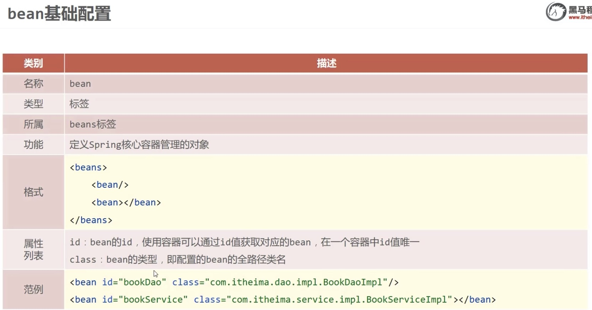

[返回概念](./Spring概念.md)

# IoC Container IoC容器

[依赖注入](#table1)
[Bean作用域和生命周期](#table2)
[自动装配注入](#TABLE3)
<br>
### <a id="table4">案例前置代码</a>
在理解Bean配置前，我们先设置两个本地的Class来说明，后面都用这两个class来解释

```JAVA
//BookServiceImpl文件，implements from BookService
public class BookserviceImpl implements Bookservice{
    // 创建一个BookDao的 object
    private BookDao bookDao = new BookDaoImpl();
    // 实现一个print的save功能，并且调用bookDao object的save功能
    public void save(){
        System.out.println("book service save ...")
        //bookDao就不写了，同样是一句print语句实现功能
        bookDao.save();
    }
}

// AppForDIAutoware文件内，用以实现Spring框架的object创建
// 核心思想就是，本地写API、method等function class。
// 通过将本地API、method class文件注入到Spring框架的xml格式的bean管理文件中
// 由Spring完成objec的创建，然后本地调用Spring中创建的Object。
public class AppForDIAutoware{
    public static void main( string[]args ){
        ApplicationContext ctx = new ClassPathXmlApplicationContext("applicationContext.xml");
        BookService bookService =(BookService)ctx.getBean("bookService");
        bookService.save(); 
    }
}
```

### 配置一个bean



**首先我们在pom.xml内导入spring的坐标**

```java
// 这个是Spring依赖代码，写在pom.xml内
<dependencies>
    <!-- Spring Context -->
    <dependency>
        <groupId>org.springframework</groupId>
        <artifactId>spring-context</artifactId>
        <version>5.3.20</version>
    </dependency>
</dependencies>
```

在[maven结构](./Spring概念.md) : main -- resources，创建 fileName.xml。只有在pom.xml内导入spring坐标后才会出现生成xml文件的选项，手动生成的话不会自动将bean依赖代码自动生成，就需要手动注入。
```java
// 这是Spring的Bean依赖代码，写在resources的xml文件内
<?xml version="1.0" encoding="UTF-8"?>
<beans xmlns="http://www.springframework.org/schema/beans"
       xmlns:xsi="http://www.w3.org/2001/XMLSchema-instance"
       xsi:schemaLocation="http://www.springframework.org/schema/beans http://www.springframework.org/schema/beans/spring-beans.xsd">
    <!--在这部分编写bean依赖-->
</beans>
```

以上代码保存完后如果有报错就reload maven project。

完成以上操作，我们就能在这个xml文件内编写bean依赖了。
```java
//单独配置式，id和class前后顺序没关系
<bean class="addressName" id="idName2"/>

// 配置属性式
<bean class="cn.xunzheng.beans.User" id="idName1">
    /*
     * 配置class和object之间的关系。
     * property：标示当前bean的属性，
     * name：标示具体哪个属性
     * ref：标示参照哪个bean，这个ref可以用name名，class名，id名都可以，只要是该bean独有的
     */
    <property name="objectAttribute" ref="idName2" />
</bean> 
```
class后的地址就是User.java文件的相对路径（在同一个project目录下）
配置的是实现类，不是接口。Spring要直接创建对象，需要class有具体方法。
id是用于之后的调用。

可以通过test--java文件夹内创建test文件来测试

调用配置文件的Type：`ApplicationContext`
new的Type：`ClassPathXmlApplicationContext`
```java
@Test // Test的注释，需要导入JUnit的jar包
public void test01(){
    /* 
     * 创建IoC容器，并加载我们的配置文件
     * ClassPathXmlApplicationContext：根据项目路径的xml配置实例化Spring容器。
     * FileSystemXmlApplicationContext：根据磁盘目录的xml配置实例化Spring容器
     */
    ApplicationContext ioc = new ClassPathXmlApplicationContext("文件名.xml");
    /* 获取Bean：1.通过className.class来获取Bean
     *          2.通过idName来获取bean，但无法获取Bean的Type，需要强制转换
     * 三种调用Bean的形式。注意，后两种必须用object实例文件名，
     * 也就是实际能够生成object而的哪个class文件的名字，而不是bean的id名。
     */
        SpringService s1 = (SpringService) ctx.getBean("sService");
        SpringService s2 = ctx.getBean("sService",SpringServiceImpl.class);
        SpringService s3 = ctx.getBean(SpringServiceImpl.class);
        s1.save();
        s2.save();
        s3.save();
}
```

### <a id="table1">依赖注入</a>

依赖注入就是注入Bean中的属性。用来描述Bean是干什么的
依赖注入（‌Dependency Injection，‌简称DI）‌的核心思想是，‌一个对象不再负责创建或查找它所依赖的对象，‌而是通过外部传递这些依赖关系。‌

**1. 基于Setter的依赖注入**
```java
// 通过property name -> value 的形式对每一个属性赋值。
<bean class="com.yardLand.main.User" id="user1">
    <property name ="id" value="1"></property>
    <property name ="userName" value="许庶"></property>
</bean>
```

```java
/* 
 * 属性也可以是另一个object，比如我们的实例BookDao和BookService。
 * BookService中有一个BookDao的object去调用BookDao的方法
 * 两者之间的关系，就靠Service中创建的这个object绑定
 * 我们将Service内的BookDao object看作一个属性，
 * 将objectName作为property name传递给Spring。
 * 注意，后面跟的不是value，而是ref。因为object关系绑定是属性连接外部，不是自赋值
 * ref中的内容是想关联的bean的id
*/ 
<bean class="com.yardLand.main.BookDao" id="BookDao"/>
<bean class="com.yardLand.main.BookService" id="BookService">
    <property name ="BookDao" value="BookDao"/>
</bean>
```

在将Service和Dao绑定关系后，我们就不需要在业务层创建Dao的object了，相应的Service文件也可以修改
```java
//BookServiceImpl文件，implements from BookService
public class BookserviceImpl implements Bookservice{
    // BookDao的object不需要new来再次创建了
    private BookDao bookDao;
    // 实现一个print的save功能，并且调用bookDao object的save功能
    public void save(){
        System.out.println("book service save ...")
        //bookDao就不写了，同样是一句print语句实现功能
        bookDao.save();
    }

    // 但我们需要在Service文件内创建一个bookDao的set method
    public void setBookDao(BookDao bookDao){
        this.bookDao = bookDao;
    }
}

```

**2. 基于Constructor的依赖注入**
   1.  可以省略name属性，但需要构造顺序与构造函数的参数顺序相同。
   2.  也可以用index或type来构造。

```java
// 通过constructor的依赖注入，必须把所有属性都注入，否则会报错
<bean class="com.yardLand.main.User" id="user1">
    <constructor-arg name="id" value="金城武"></constructor-arg>
    <constructor-arg name="userName" value="金城武"></constructor-arg>
    <constructor-arg name="realName" value="金城武"></constructor-arg>
</bean>
```

### 各种形式的其他注入
```JAVA
//各种形式的注入
<bean class="com.yardLand.main.User" id="user1">
    <property name="user" value="1"></property>

    
    //设置null
    <property name="name">
        <null></null>
    </property>
    
    //引用外部Bean, ref为外部bean的id
    <property name="name" ref="wife"></property>
    
    <bean class="XXXXXX" id="wife">
        <property name="age" value="18"></property>
        <property name="name" value="迪丽热巴"></property>
    </bean>
   
    //使用内部bean来依赖注入
    <property name="wife">
        <bean class="XXXXXX">
            <property name="age" value="18"></property>
            <property name="name" value="迪丽热巴"></property>
        </bean>
    </property>
    
    /* list/map属性注入
     * type是数据类型, list就用<value>，map就用<entey>
     * list的bean要用<bean>包裹,map用<entry value-ref="xxx">
     */
    <property name="arrayName">
        <array>
            <value>100</value>
            <value>200</value>
            <value>300</value>
        </array>
    </property>

    <property name="ListName">
        <list>
            //每一个value块代表list内一个element
            <value>StringValue</value>
            <value>StringValue2</value>
        </list>
    </property>

    <property name="setName">
        <set>
            <value>100</value>
            <value>200</value>
            <value>100</value> //此行不出现，set的不重复特性
        </set>
    </property>

    <property name="mapName">
        <map>
            <entry key="1" value="1"/> 
            <entry key="2" value="1"/> // 此行出现，value可重复
            <entry key="1" value="3"/> // 此行不出现，key不重复，但value是否会更改有待验证
        </map>
    </property>

    // properties key在<>内设置，value在包裹中设置
    <property name="propertiesName">
        <props>
            <prop key="country">china</prop>
            <prop key="province">henan</prop>
            <prop key="city">kaifeng</prop>
        </props>
    </property>
</bean>
</bean>
```

Setter方式有一个P命名空间的简化方式（不支持集合）
Constructor有一个C命名空间。


### <a id="TABLE3">自动装配注入</a>
IoC容器根据bean所依赖的资源在容器中自动查找并注入到bean中的过程称为自动装配
1. 按类型（最常用）
2. 按名称
```JAVA
/* XML文件内，自动配置的情况下，不需要<property>注入
 * autowire会自动弹出5种自动配置的方式
 * 1. byType 2. byName 3. constructor 4. default 5. no
 */
<bean id="bookService" class="com.xxx.service.BookServiceImpl" autowire="byType" />
```

* **注意**：自动装配会调用class内的关系，bookService内创建了BookDao的object，所以autowire会寻找BookDao文件关联的bean。如果同一个关联文件，出现了两个bean就会报错。虽然这种情况几乎不会出现。

当然我们也可以***按名称***装配
```JAVA
// 按名称是由id来决定的，BookService内是BookDao的对象，所以匹配id=“bookDao”
<bean id="bookService" class="com.xxx.service.BookServiceImpl" autowire="byName" />
```

### <a id="table2">Bean作用域和生命周期</a>

Spring框架在IoC容器内创建Bean默认是单例，创建一次后不会再继续创建。甚至两个不同变量名也不会更改。如果需要创建多例，代码如下
```java
// scope内一共就两个选项：singleton/prototype
<bean id="name" class="xxxxx" scope="xxx">
```
默认是singleton，使用prototype后，IoC创建的Bean就不会是单例了。

```java
// init-method, destory-method分别对应了生成和毁灭节点
<bean id="book" class="xxxxx" init-method="创建对象中的方法名" destory-method="创建对象中的方法名"></bean>
```

这个方法是用来对对象创建时和销毁时做出一些功能的。
但实际上，很多时候object销毁前，程序已经关闭了，虚拟机也就关闭了，IoC容器来不及销毁。
所以，我们可以手动写一个关闭容器的功能，用以手动关闭容器，以此达到销毁object的目的。
```java
/* 实现类中
 * 因为ApplicationContext没有close()方法。
 * 所以为了实现close()方法，不能用多态来定义xml文件
 */
ClassPathXmlAppicationContext ctx = new ClassPathXmlAppicationContext("applicationContext.xml")
/*
 * 第一种方法，该方法比较暴力。
 * 如果写在部分功能代码之前，会导致功能不运行，直接关闭
 */
ctx.close();
// 第二种方法
ctx.registerShutdownHook();
```

```java
/* Spring自带的生命周期API
 * InitializingBean，DisposableBean
 * 如果用Spring方法，需要在实现类中implements上面两个接口，
 */
public class BookServiceImpl implements BookService, InitializingBean, DisposableBean{
    // 已在IoC中配置过的对象，implements from BookService API
    private BookDao bookDao;
    // 默认setter方法
    public void setBeanDao(BookDao  bookDao){
        this.bookDao = bookDao;
    }

    public void save(){
        //实现功能
    }

    //Spring自带生命周期方法
    public void destory()throws Exception{
        // destory parts
    }

    public void afterPropertiesSet()thorws Exception{
        // init parts
    }
}

```


