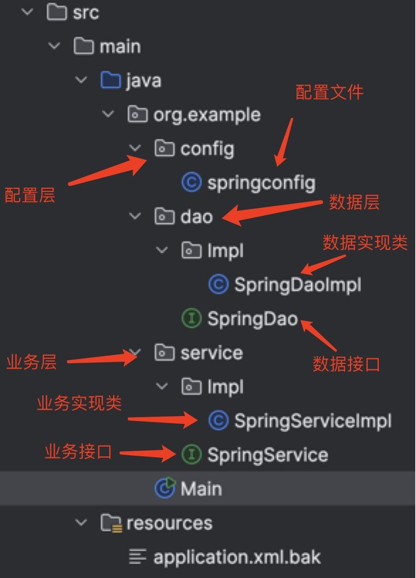

[返回首页](./1.Spring概念.md)

# 纯注解开发
1. [纯注解开发](#table2)
2. [单例和多例](#table3)
3. [纯注解开发Bean的生命周期](#table4)
4. [依赖注入](#table)
5. [简单类型注入](#table1)

### <a id="table2">纯注解开发</a>
纯注解开发是可以脱离xml文件的。也就是说，纯注解开发，我们能够抛开之前注入式开发时要创建一个xml文件去注入bean的方式。

我们需要在Service（业务层） / Dao（数据层）等平行位置设立一个配置层。


从图片上我们能看到，最下面的xml文件已经被改名，无法被调用了

配置文件中代码如下：
```java
<!--config file-->
/* package 和 import省略不写了，可自动生成
 * Configuration 是Spring框架中配置的注解，功能为：
 * 1. 将原本xml中的bean依赖代码注入到配置注释中
 * 2. 将配置文件作为配置bean的入口。
 */ 
@Configuration
/* 扫描所标示目录下的所有bean class，这两条都写在最外层class和import之间。
 * 该条注释只能使用一次，如果需要多个路径，可以使用数组的形式：
 * @ComponentScan({"org.example.dao", "org.example.service", ...})
 */ 
@ComponentScan("org.example")
public class springconfig {
}

<!--main中的object创建需要修改-->
// 大部分import都会自动生成
public class App {
    public static void main(String[] args) {
        // 创建的spring object 管理对象为 AnnotationConfigApplicationContext(configFileName.class)
        ApplicationContext ctx = new AnnotationConfigApplicationContext(springconfig.class);
    }
}
```

### <a id="table3">纯注解开发Bean的单例和多例</a>
单例（只创建一个object，内存地址不变）
多例（创建多个object，内存地址变）
使用 **`@Scope`** 注解来简单标注Bean是单例还是多例
```java
    @Scope // 默认单例
    @Scope("singleton")
    @Scope("prototype")  // 多例
```

### <a id="table4">纯注解开发Bean的生命周期</a> 
```java
    <!--执行实例class内-->
    /* function那么不重要，重要的是注解
     * @PostConstructor 和 @PreDstroy 都是在javax.annotation的jar包
     * 这两个实现一个在构造后，一个在销毁前。
     */
    @PostConstruct
    public void init() {
        System.out.println("init。。。");
    }
    @PreDestroy
    public void destory() {
        System.out.println("destory。。。");
    }

    <!--mian file-->
    // 调用那两个功能，不能使用多态创建object。
    AnnotationConfigApplicationContext ctx = new AnnotationConfigApplicationContext(springconfig.class);

    // 销毁程序需要程序关闭对象。
    ctx.close();
```

### <a id="table">依赖注入</a> 
```java
//因为纯注解方式代码相对简单，我把四个文件的代码再次放一下，以便查看
<!--Config file-->
// config annotate
@Configuration
// component scan annotate， 用来识别object 的 class 组件
@ComponentScan("org.example")
public class springconfig {
}

<!--SpringDao Implement file, ignore interface-->
// data layer object annotate 数据层注解
@Repository
public class SpringDaoImpl implements SpringDao{
    @Override
    public void save() {
        System.out.println("this is SpringDao");
    }
}

<!--SpringService file, ignore interface-->
// 
@Service
public class SpringServiceImpl implements SpringService {
    // 自动依赖注入，自动将Dao和Service关联起来，默认按类型装配
    // 并且，纯注解模式可以省略set方法。
    // 但按类型装配的问题仍然存在，object只能为单例
    // 在下面的代码块演示多例object的用法
    @Autowired
    private SpringDao springDao;

    @Override
    public void save(){
        System.out.println("this is SpringSerivce");
        springDao.save();
    };
}

<!--main function file-->
public class App {
    public static void main(String[] args) {
        /* 创建的spring object 管理对象为 
         * AnnotationConfigApplicationContext(configFileName.class)
         * 如果要使用init和destroy方法，不能用多态。
         * 其他都和正常Spring java Bean 一样
         */
        AnnotationConfigApplicationContext ctx = new AnnotationConfigApplicationContext(springconfig.class);

        SpringService s1 = ctx.getBean(SpringServiceImpl.class);

        s1.save();
    }
}
```

如果有多例object（多个不同名称却具有相同implement来源object class）
```java
// 假设有两个SpringDao数据文件,两个文件都implements from SpringDao
// 此时我们就需要给这两个文件命名。以便main来区分。

<!--SpringDao1 file-->
@Repository("sDao1"
public class SpringDao1 implements from SpringDao{
    
}
@Repository("sDao2")
<!--SpringDao2 file-->
public class SpringDao2 implements from SpringDao{
    
}

<!--SpringService file-->
    @Autowired          // AutoWired不支持name search
    @Qualifier("sDao")  // Qualifier支持name search,但必须依赖@Autowired
    private SpringDao springDao;
```

### <a id="table2">简单类型注入</a>

```java
<!--SpringDao file-->
@Repository("sDao")
public class SpringDaoImpl implements SpringDao{
    @Value("Kevin He") // assgin annotate 赋值注释
    private String name;

    @Override
    public void save() {
        System.out.println("this is SpringDao ... " + name);
    }
}
```

上面是最简单的value 注入方式。但通常我们很多数据需要通过数据库文件来注入。   
Java可以用`.properties`文件来储存数据，由`@Value`直接读取，然后传递给SpringDao的object。

```java
<!--springconfig file-->
@Configuration
@ComponentScan("org.example") 
// 其他都不变，只增加一个PropertySource的注解
// 格式：@Properties(".properties file address")
// 这个注解是导入数据资源文件的注解
@PropertySource("jdbc.properties")
// 这个注解方式也可以，更复杂一点，没必要
@PropertySource("classpath: jdbc.properties")
// 如果是多文件的话要使用数组的形式，该注解是存在唯一性的，只能有一个。
@PropertySource({"jdbc.properties","ali.properties", ...})
public class springconfig {
}

<!--SpringDao file-->
    /* @Value中的值的格式为
     * @value( "${parameter_Key_Name} " ) 
     * 双引号包裹，金钱符跟大括号，大括号内为 .properties 文件内的属性
     * 这样就会把 .properties 文件内属性的值传递回来
     */
    @Value("${name}") 
    private String name;
```
