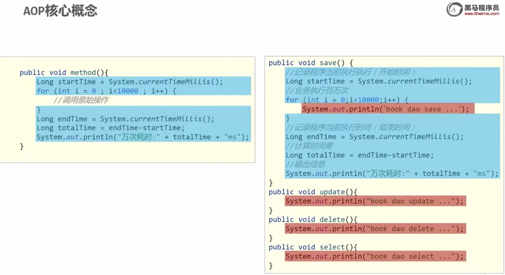
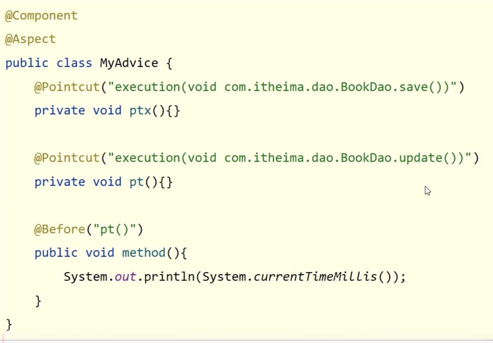

[返回目录](./1.Spring概念.md)


[AOP案例测试](./AOP案例测试.md)

# AOP(Aspect Oriented Programming) 面向切面编程
作用：在不惊动原始设计的基础上为程序进行功能增强。

它是靠通过一个通知层，将想要插入的功能单独提取出来。通过原设计的程序切入点，注入新的代码。



设计思路：
1. 导入`pom.xml`坐标
2. 制作连接点方法（原始操作，Dao接口与实现类）
3. 制作共性功能（通知类/通知）
4. 定义切入点
5. 绑定切入点与通知类的关系

然后我们跟着思路实施：
1. **导入坐标**：AOP是默认在spring freamwork的依赖下。但有另一个依赖也要导入。
```java
        <dependency>
            <groupId>org.aspectj</groupId>
            <artifactId>aspectjweaver</artifactId>
            <version>1.9.6</version> //版本根据现有更新
        </dependency>
```

1. 制作连接点method：原程序中的某个功能，已存在
2. **制作共性功能**：
```java
<!--通知层/通知类-->
// 加载入Spring框架，让Spring能读取到
@Component
// 在Spring中注释为AOP
@Aspect
//创建一个和dao，service平级的aop层，并创建一个通知类
public class Notice {
    // 该注释是在org.aspectj坐标依赖下的
    // Pointcut是切入点的注释，execution是执行监视器，参数是监听的方法的完整地址
    @Pointcut("execution(void org.example.dao.SpringDao.update())")
    // 给切入点做一个本地副本，作为接口让其他方法切入
    private void pt(){}

    // 刚刚的是程序切口接入点，当程序监听到切入点程序运行时，以下方法先运行
    @Before("pt()")
    void method(){
        //将共性功能单独提取出来，成为一个方法
        //所谓共性功能，就是原设计中的功能，在增强版中仍然需要的功能
        long startTime = System.currentTimeMillis();
        System.out.println(startTime);
    }
}


<!--springconfig file-->
// 在config配置文件中要加上这个注释，来识别@Aspect AOP相关的注解
@EnableAspectJAutoProxy

```


### AOP工作流程
1. Spring IoC容器启动
2. 读取所有切面配置中的切入点


图片上有两个切入点。但只切入了一个切入方法

3. 初始化Bean，判定Bean对应的类中的方法是否匹配到任意切入点
   * 匹配失败，创建对象
   * 匹配成功，创建原始对象的代理对象（实际的地址和创建的对象地址是不同的）
4. 获取bean执行方法
   * 获取bean，调用方法并执行
   * 获取的bean是代理对象时，根据代理对象的运行模式，运行原始方法和增强的内容。

**目标对象(Target)**:原始功能去掉共性功能对应的类产生的对象,这种对象是无法直接完成最终工作的
**代理(Proxy)**:目标对象无法直接完成工作，需要对其进行功能回填，通过原始对象的代理对象实现


### AOP切入点表达式

切入点表达式是指在`@Pointcut()`括号内的描述方式。

标准格式：
|动作关键字|访问修饰符|返回值|包名.类/接口.方法名(参数)异常名|
|----|----|---|----|
execution之类|public之类|void之类|org.example.dao.SpringDao.update(int)|
||访问修饰符通常被省略

1. 描述方式一：执行无参方法
   ```java
    @Pointcut("execution (void org.example.dao.SpringDao.update(int))")
   ```

2. 描述方法二：实现类也可以，也就是可以直接详细到`Impl`下的`SpringDaoImpl.update()`

**为了简化批量操作**，AOP的切入点描述，可以使用通配符
1. `*` 单个独立的任意符号，可以独立出现，也可作为前缀/后缀的匹配符出现
    ```java
     execution(public * com.itheima.*.UserService.find*(*))
    ```
    * 第一个`*`标示任意返回值，
    * 第二个`*`标示com.itheima这个 包下任意文件夹，
    * 第三个`*`是UserService类或接口中以find开头的方法，
    * 第四个`*`，标示这个find开头的方法，必须带有参数
    完整的描述就是：匹配com.itheima包下的任意包中的UserService类或接口中所有find开头的带有一个参数的方法

2. `..` 多个连续任意符号，可独立出现，常用于简化包名与参数的书写
   ```java
     execution(public User com..UserService.findById(..))
    ```
    * 第一个`..` ：com包下搜索UserServic类或接口
    * 第二个`..` ；所有命名为findById（）的方法，包括有参和无参

3. `+` 专用于匹配子类类型
    ```java
     execution(* *..*Service+.*(..))
    ```
    *  这个标示：任意返回值，任意包下，以Service结尾的子类（`+` 代表子类）

### AOP通知类型

1. 前置通知：`@Before("pointName")`
```java
    @Before("pt()")
    void before(){
        System.out.println("before pointcut");
    }
```

2. 后置通知：`@After("pointName")`
```java
    @After("pt()")
    void after(){
        System.out.println("after pointcut");
    }
```
   
3. **环绕通知**：`@Around("pointName")`
```java
    @Around("pt()")
    void around(ProceedingJoinPoint pj) throws Throwable {
        System.out.println("around before pointcut");
        pj.proceed();
        System.out.println("around after pointcut");
    }
```
   * `@Around`是唯一一个需要另外导包的
   * 参数必须加上`ProceedingJoinPoint`, 
   * 否则一旦被around包裹，当中的程序就不运行了。
   * `pj.proceed()`表示运行切入点程序。
   * 在运行切入点程序前的为before状态，切入点后的为after状态
   * 强制抛出异常，因为需要调用外部执行程序，如果出现问题会导致程序崩溃
   * 如果`@Around()`通知包裹的方法有返回值。则需要将返回值返回。
```java
    // 通识符地址识别
    @Pointcut("execution(int org..*Impl.select())")
    private void pt2(){};

    @Around("pt2()")
    // 有返回值的情况下，Around的function返回值为Object
    // 他返回的是一整个代理对象，不是单个的返回值
    Object around2(ProceedingJoinPoint pj) throws Throwable {
        System.out.println("around before pointcut");
        // 因为有返回值，所以proceed()方法需要在赋值内进行。
        Integer proceed = (Integer) pj.proceed();
        System.out.println("around after pointcut");
        // 返回被赋值的value
        return proceed + 20;
    }
```
4. 返回后通知：`@AfterReturning("pointName")`
    
    只有在程序没有异常时才会运行。

    ```java
    @AfterReturning("pt()")
    void afterReturn(){
        System.out.println("after return pointcut");
    }
    ```
5. 抛出异常后通知：`@AfterThrowing("pointName")`
   
    和`@AfterReturning`正好相反,只有抛出异常时才会出现。

```java
    @AfterThrowing("pt()")
    void afterThrow(){
        System.out.println("after throw pointcut");
    }
```