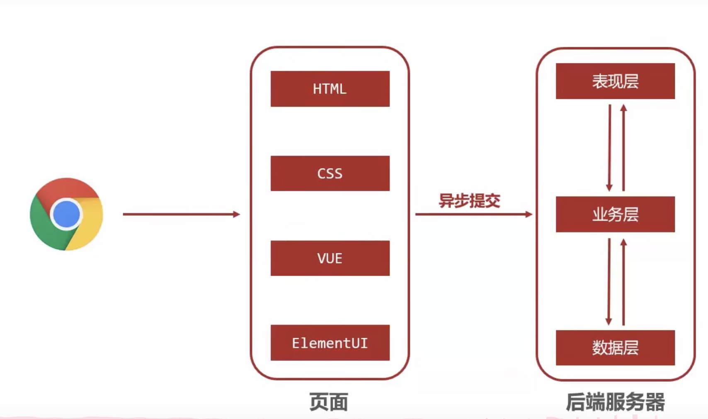

[返回首页](./1.Spring概念.md)

[入门案例](#table1)
[Get/Post请求](#table2)

# Spring MVC

是针对表象控制层的技术，等同于servlet。属于web层开发技术



SpringMVC就是web层框架技术，等同于Spring framework基于Dao/Service
```java
<!--pom.xml 依赖-->
   <dependencies>
        <!-- Spring Boot Starter -->
        <dependency>
            <groupId>org.springframework.boot</groupId>
            <artifactId>spring-boot-starter-web</artifactId>
            <version>2.7.3</version>
        </dependency>

        <!-- JUnit -->
        <dependency>
            <groupId>junit</groupId>
            <artifactId>junit</artifactId>
            <version>3.8.1</version>
            <scope>test</scope>
        </dependency>

        <!--Spring framework-->
        <dependency>
            <groupId>org.springframework</groupId>
            <artifactId>spring-webmvc</artifactId>
            <version>5.3.22</version>
        </dependency>

        <!-- 添加 JSTL 依赖 -->
        <dependency>
            <groupId>javax.servlet</groupId>
            <artifactId>jstl</artifactId>
            <version>1.2</version>
        </dependency>
    </dependencies>

    <build>
        <plugins>
            <plugin>
                <groupId>org.springframework.boot</groupId>
                <artifactId>spring-boot-maven-plugin</artifactId>
                <version>2.7.3</version>
            </plugin>
        </plugins>
    </build>

    <properties>
        <maven.compiler.source>17</maven.compiler.source>
        <maven.compiler.target>17</maven.compiler.target>
        <project.build.sourceEncoding>UTF-8</project.build.sourceEncoding>
    </properties>

<!--Bean file-->
//创建SpringMVc控制器类(等同于Servlet功能)
@Controller
public class Usercontroller {
    // 设定请求访问的页面路径
    @RequestMapping("/save")
    // 做controller class
    @ResponseBodypublic 
    
    // 定义方法，返回值为字符串的话则是json模式。
    string save(){
        System.out.println("user save ...");r
        eturn "{'info':'springmvc'}";
    }
}

<!--config file 配置Bean-->
//初始化SpringMVC环境(同Spring环境)，设定SpringMVc加载对应的bean
@Configuration
@ComponentScan("com.itheima.controller")
public class springMvcConfig {
}
 
<!--SpringBoot main file 执行文件-->
@SpringBootApplication
public class SpringMVCApplication {
    public static void main(String[] args) {
        SpringApplication.run(SpringMVCApplication.class, args);
    }
}
```

### <a id="table1">入门案例</a>

```java
<!--Controller file 表象控制层文件-->
@Controller
public class UserCtrl {
    // 设置当前方法的访问路径
    @RequestMapping("/save")
    // 设置当前操作的返回值
    @ResponseBody
    public String save(){
        System.out.println("mvc saving ...");
        return "{'info':'this is a spring mvc test'}";
    }

}

<!--SpringMVC config file-->
// 创建SpringMVC的配置，加载UserController Bean
@Configuration
@ComponentScan("com.SpringMVCExample.controller")
public class SpringMVCconfig {

}


<!--SpringBoot main file 执行文件-->
// 自动加载所有数据文件，调用自身展开服务器
@SpringBootApplication
public class SpringMVCApplication {
    public static void main(String[] args) {
        SpringApplication.run(SpringMVCApplication.class, args);
    }
}
```

### 单次请求过程
1. 发送请求localhost/save
2. web容器发现所有请求都经过SpringMvc，将请求交给SpringMVc处理
3. 解析请求路径/save
4. 由/save匹配执行对应的方法save()
5. 执行save()
6. 检测到有@ResponseBody直接将save()方法的返回值作为响应求体返回给请求方
```java
//因为会有很多controller功能，所以我们可以在外部加载**映射路径**
@Controller
// 全局映射路径
@RequestMapping("/book")
public class BookCtrl {
    @RequestMapping("/save")
    @ResponseBody
    public String save() {
        System.out.println("book saving...");
        return "{this is book saving}";
    }
```

### <a id="table2">Get/Post请求</a>

请求的参数如何获取
```java
    @RequestMapping("/commonParam")
    @ResponseBody
    public String commonParam(String name, int age){
        System.out.println("common Param transfor => " + name);
        System.out.println("common Param transfor => " + age);
        return "{'info':'this is a common param request'}";
    }

    // 对地址的修改就带有参数的回传
    // 问号之后是value属性，等号之后是value。&符号连接第二个参数
    "http://localhost:8080/user/commonParam?name=Johnny&age=38"
    
```

```java
<!--异名参数-->
    @RequestMapping("/cParamDiffName")
    @ResponseBody
    // get属性名和传参名不同
    public String cParamDiffName(@RequestParam("name") String userName,int age){
        System.out.println(userName);
        System.out.println(age);
        return "{'module' : 'common param diff'}";
    }

<!--pojo parameter-->
    // Pojo parameter 传参为class object,
    // 只要get数据和object属性相同，即可传入参数
    @RequestMapping("/pojo")
    @ResponseBody
    public String pojo(User user){
        System.out.println(user);
        return "{'module' : 'pojo parameter'}";
    }

    // 如果object中某个属性也是外部对象导入
    // 在传参时只需要逐层注释即可
    // 比如，如果是在address是一个object，也是user的一个属性
    // address的属性为，addr 和 city
    // 参数则为：address.addr，address.city

<!--Array 和 List 参数-->
// Array比较简单，使用同一个属性名就可以了，代码不赘述
// List会被认为是object，所以需要前缀告知是List
public String listParam(@RequestParam List<String> userName){
    <!-- coding here-->>
}


```
